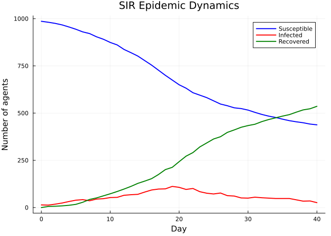

# Introduction to Starsim.jl
Simon Frost

- [Overview](#overview)
- [Quick start](#quick-start)
- [Building a basic SIR model](#building-a-basic-sir-model)
  - [Understanding the parameters](#understanding-the-parameters)
- [Accessing results](#accessing-results)
- [Exporting to DataFrame](#exporting-to-dataframe)
- [Plotting the epidemic curve](#plotting-the-epidemic-curve)
- [Next steps](#next-steps)

## Overview

**Starsim.jl** is a Julia port of the [Starsim](https://starsim.org)
agent-based modeling framework for simulating disease transmission. It
provides a modular architecture where diseases, contact networks,
demographics, interventions, and analyzers are independent components
that can be composed into complex simulations.

Key features:

- **Agent-based**: Each individual is tracked with unique states
- **Modular**: Mix and match diseases, networks, demographics, and
  interventions
- **Fast**: Native Julia compilation (no separate Numba step)
- **CRN-safe**: Common Random Numbers support for robust scenario
  comparison
- **GPU-ready**: Parametric array types allow Metal.jl/CUDA.jl backends

## Quick start

The simplest way to run a simulation is the `demo()` function, which
sets up an SIR model on a random contact network.

``` julia
using Starsim

sim = demo(n_agents=1000, verbose=0)
```

    Sim(1000 agents, 0.0→40.0, dt=1.0, nets=1, dis=1, status=complete)

## Building a basic SIR model

Let’s build the same simulation explicitly to understand the components.

``` julia
n_contacts = 10
beta = 0.5 / n_contacts  # R₀ ≈ beta × n_contacts × dur_inf = 2

sim = Sim(
    n_agents = 1_000,
    networks = RandomNet(n_contacts=n_contacts),
    diseases = SIR(beta=beta, dur_inf=4.0, init_prev=0.01),
    dt = 1.0,       # 1 day timestep
    stop = 40.0,    # simulate for 40 time units (10× infectious period)
    rand_seed = 42,
    verbose = 0,
)
run!(sim)
```

    Sim(1000 agents, 0.0→40.0, dt=1.0, nets=1, dis=1, status=complete)

### Understanding the parameters

- `n_agents = 1000`: Simulate 1,000 individuals
- `RandomNet(n_contacts=10)`: Each agent has ~10 contacts per day
  (bidirectional, so 5 edges created per agent)
- `beta = 0.5 / n_contacts = 0.05`: Transmission rate per contact,
  chosen so that R₀ ≈ β × c × D = 0.05 × 10 × 4 = 2
- `SIR(dur_inf=4.0, init_prev=0.01)`: Mean infectious period of 4 time
  units, 1% initial prevalence
- `dt = 1.0`: Time is measured in days
- `stop = 40.0`: Run for 40 time units (10× the infectious period)

## Accessing results

Results are stored per-module. Access them by disease name and result
name:

``` julia
n_sus = get_result(sim, :sir, :n_susceptible)
n_inf = get_result(sim, :sir, :n_infected)
n_rec = get_result(sim, :sir, :n_recovered)
prev = get_result(sim, :sir, :prevalence)

println("Peak prevalence: $(round(maximum(prev), digits=4))")
println("Final susceptible: $(Int(n_sus[end]))")
println("Final recovered: $(Int(n_rec[end]))")
```

    Peak prevalence: 0.112
    Final susceptible: 438
    Final recovered: 536

## Exporting to DataFrame

Convert all results to a tidy DataFrame for further analysis:

``` julia
using DataFrames

df = to_dataframe(sim)
println("Columns: ", names(df))
println("Rows: ", nrow(df))
first(df, 5)
```

    Columns: ["time", "n_alive", "sir_new_infections", "sir_n_susceptible", "sir_n_infected", "sir_n_recovered", "sir_prevalence"]
    Rows: 40

<div><div style = "float: left;"><span>5×7 DataFrame</span></div><div style = "clear: both;"></div></div><div class = "data-frame" style = "overflow-x: scroll;">

| Row | time | n_alive | sir_new_infections | sir_n_susceptible | sir_n_infected | sir_n_recovered | sir_prevalence |
|---:|---:|---:|---:|---:|---:|---:|---:|
|  | Float64 | Float64 | Float64 | Float64 | Float64 | Float64 | Float64 |
| 1 | 0.0 | 1000.0 | 4.0 | 986.0 | 14.0 | 0.0 | 0.014 |
| 2 | 1.0 | 1000.0 | 5.0 | 981.0 | 13.0 | 6.0 | 0.013 |
| 3 | 2.0 | 1000.0 | 6.0 | 975.0 | 18.0 | 7.0 | 0.018 |
| 4 | 3.0 | 1000.0 | 8.0 | 967.0 | 24.0 | 9.0 | 0.024 |
| 5 | 4.0 | 1000.0 | 11.0 | 956.0 | 32.0 | 12.0 | 0.032 |

</div>

## Plotting the epidemic curve

``` julia
using Plots

tvec = 0:length(n_sus)-1
plot(tvec, n_sus, label="Susceptible", lw=2, color=:blue)
plot!(tvec, n_inf, label="Infected", lw=2, color=:red)
plot!(tvec, n_rec, label="Recovered", lw=2, color=:green)
xlabel!("Day")
ylabel!("Number of agents")
title!("SIR Epidemic Dynamics")
```



## Next steps

- **Vignette 02**: Building custom models with different components
- **Vignette 03**: Adding births and deaths with demographics
- **Vignette 04**: Working with different disease models (SIS, SEIR)
- **Vignette 08**: Measles outbreak modeling with SEIR
