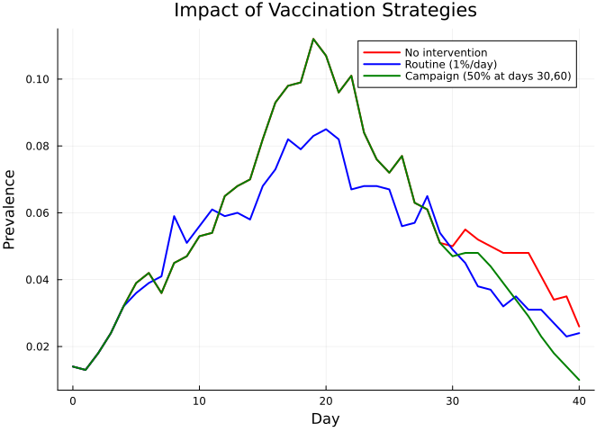
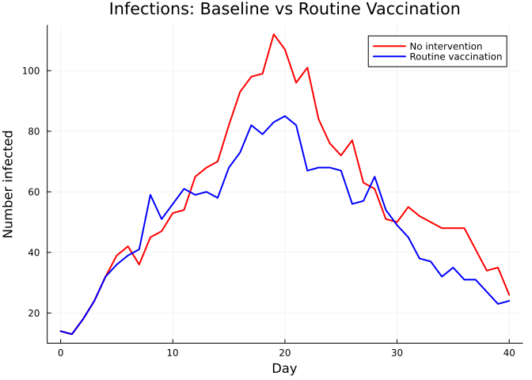
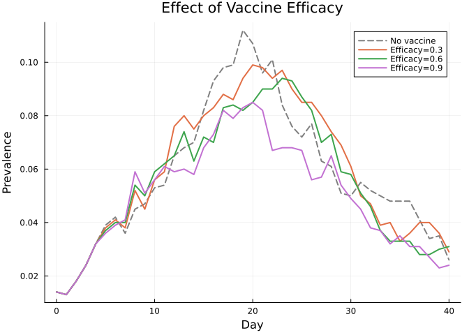
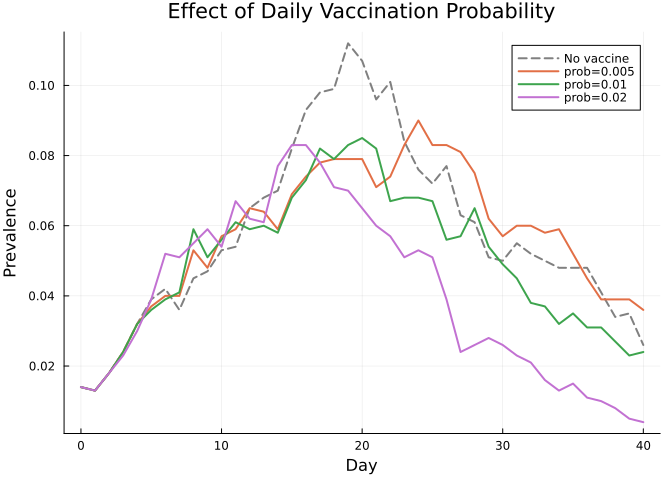
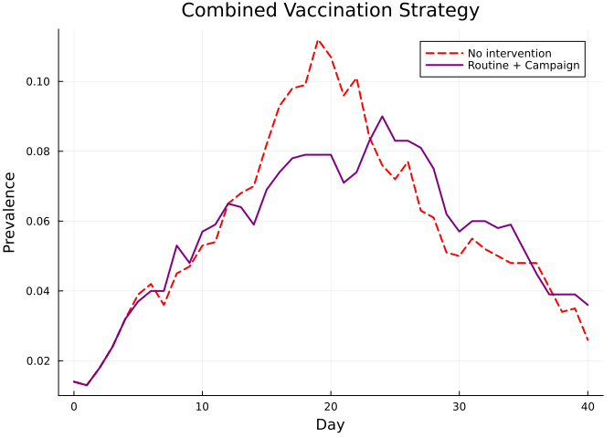

# Interventions
Simon Frost

- [Overview](#overview)
- [Baseline: no intervention](#baseline-no-intervention)
- [Defining a vaccine product](#defining-a-vaccine-product)
- [Routine delivery](#routine-delivery)
- [Campaign delivery](#campaign-delivery)
- [Comparing baseline vs
  interventions](#comparing-baseline-vs-interventions)
- [Epidemic curves: baseline vs routine
  vaccination](#epidemic-curves-baseline-vs-routine-vaccination)
- [Varying vaccine efficacy](#varying-vaccine-efficacy)
- [Varying routine delivery
  probability](#varying-routine-delivery-probability)
- [Combining routine and campaign
  delivery](#combining-routine-and-campaign-delivery)
- [Summary](#summary)

## Overview

Interventions in Starsim.jl allow you to model public health responses:
vaccination campaigns, routine immunization programs, and more. This
vignette demonstrates how to define vaccine products and deliver them
through **routine** and **campaign** delivery mechanisms, then compare
epidemic outcomes.

## Baseline: no intervention

First, we run an SIR simulation without any intervention as a reference.

``` julia
using Starsim
using Plots

n_contacts = 10
beta = 0.5 / n_contacts

sim_base = Sim(
    n_agents = 1_000,
    networks = RandomNet(n_contacts=n_contacts),
    diseases = SIR(beta=beta, dur_inf=4.0, init_prev=0.01),
    dt = 1.0,
    stop = 40.0,
    rand_seed = 42,
    verbose = 0,
)
run!(sim_base)

prev_base = get_result(sim_base, :sir, :prevalence)
println("Baseline peak prevalence: $(round(maximum(prev_base), digits=4))")
```

    Baseline peak prevalence: 0.112

## Defining a vaccine product

A `Vx` product defines what the vaccine does. The `efficacy` parameter
is the probability that vaccination successfully immunizes an
individual.

``` julia
vaccine = Vx(efficacy=0.9)
```

    Vx(:vx, "Vaccine", 0.9, StableRNGs.LehmerRNG(state=0x00000000000000000000000000000001))

## Routine delivery

`RoutineDelivery` vaccinates a fraction of the population at every
timestep. This mimics continuous vaccination programs like childhood
immunization.

``` julia
routine = RoutineDelivery(product=vaccine, prob=0.01, disease_name=:sir)

sim_routine = Sim(
    n_agents = 1_000,
    networks = RandomNet(n_contacts=n_contacts),
    diseases = SIR(beta=beta, dur_inf=4.0, init_prev=0.01),
    interventions = routine,
    dt = 1.0,
    stop = 40.0,
    rand_seed = 42,
    verbose = 0,
)
run!(sim_routine)

prev_routine = get_result(sim_routine, :sir, :prevalence)
println("Routine vaccination peak prevalence: $(round(maximum(prev_routine), digits=4))")
```

    Routine vaccination peak prevalence: 0.085

## Campaign delivery

`CampaignDelivery` vaccinates a fraction of the population at specific
time points. This mimics mass vaccination campaigns.

``` julia
campaign = CampaignDelivery(
    product = vaccine,
    coverage = 0.5,
    years = [30.0, 60.0],
    disease_name = :sir,
)

sim_campaign = Sim(
    n_agents = 1_000,
    networks = RandomNet(n_contacts=n_contacts),
    diseases = SIR(beta=beta, dur_inf=4.0, init_prev=0.01),
    interventions = campaign,
    dt = 1.0,
    stop = 40.0,
    rand_seed = 42,
    verbose = 0,
)
run!(sim_campaign)

prev_campaign = get_result(sim_campaign, :sir, :prevalence)
println("Campaign vaccination peak prevalence: $(round(maximum(prev_campaign), digits=4))")
```

    Campaign vaccination peak prevalence: 0.112

## Comparing baseline vs interventions

``` julia
tvec_b = 0:length(prev_base)-1
tvec_r = 0:length(prev_routine)-1
tvec_c = 0:length(prev_campaign)-1

plot(tvec_b, prev_base, label="No intervention", lw=2, color=:red)
plot!(tvec_r, prev_routine, label="Routine (1%/day)", lw=2, color=:blue)
plot!(tvec_c, prev_campaign, label="Campaign (50% at days 30,60)", lw=2, color=:green)
xlabel!("Day")
ylabel!("Prevalence")
title!("Impact of Vaccination Strategies")
```



## Epidemic curves: baseline vs routine vaccination

``` julia
n_inf_base = get_result(sim_base, :sir, :n_infected)
n_inf_rout = get_result(sim_routine, :sir, :n_infected)

tvec_ib = 0:length(n_inf_base)-1
tvec_ir = 0:length(n_inf_rout)-1

plot(tvec_ib, n_inf_base, label="No intervention", lw=2, color=:red)
plot!(tvec_ir, n_inf_rout, label="Routine vaccination", lw=2, color=:blue)
xlabel!("Day")
ylabel!("Number infected")
title!("Infections: Baseline vs Routine Vaccination")
```



## Varying vaccine efficacy

``` julia
efficacies = [0.3, 0.6, 0.9]
p = plot(xlabel="Day", ylabel="Prevalence", title="Effect of Vaccine Efficacy")

# Add baseline
plot!(p, tvec_b, prev_base, label="No vaccine", lw=2, color=:gray, ls=:dash)

for eff in efficacies
    vx = Vx(efficacy=eff)
    delivery = RoutineDelivery(product=vx, prob=0.01, disease_name=:sir)
    sim = Sim(
        n_agents=1_000, networks=RandomNet(n_contacts=n_contacts),
        diseases=SIR(beta=beta, dur_inf=4.0, init_prev=0.01),
        interventions=delivery,
        dt=1.0, stop=40.0, rand_seed=42, verbose=0,
    )
    run!(sim)
    prev = get_result(sim, :sir, :prevalence)
    plot!(p, 0:length(prev)-1, prev, label="Efficacy=$eff", lw=2)
end
p
```



## Varying routine delivery probability

``` julia
probs = [0.005, 0.01, 0.02]
p = plot(xlabel="Day", ylabel="Prevalence", title="Effect of Daily Vaccination Probability")
plot!(p, tvec_b, prev_base, label="No vaccine", lw=2, color=:gray, ls=:dash)

for pr in probs
    vx = Vx(efficacy=0.9)
    delivery = RoutineDelivery(product=vx, prob=pr, disease_name=:sir)
    sim = Sim(
        n_agents=1_000, networks=RandomNet(n_contacts=n_contacts),
        diseases=SIR(beta=beta, dur_inf=4.0, init_prev=0.01),
        interventions=delivery,
        dt=1.0, stop=40.0, rand_seed=42, verbose=0,
    )
    run!(sim)
    prev = get_result(sim, :sir, :prevalence)
    plot!(p, 0:length(prev)-1, prev, label="prob=$pr", lw=2)
end
p
```



## Combining routine and campaign delivery

Multiple interventions can be used together.

``` julia
vx = Vx(efficacy=0.9)
combined = [
    RoutineDelivery(product=vx, prob=0.005, disease_name=:sir),
    CampaignDelivery(product=vx, coverage=0.3, years=[50.0], disease_name=:sir),
]

sim_combined = Sim(
    n_agents = 1_000,
    networks = RandomNet(n_contacts=n_contacts),
    diseases = SIR(beta=beta, dur_inf=4.0, init_prev=0.01),
    interventions = combined,
    dt = 1.0,
    stop = 40.0,
    rand_seed = 42,
    verbose = 0,
)
run!(sim_combined)

prev_combined = get_result(sim_combined, :sir, :prevalence)
tvec_cb = 0:length(prev_combined)-1

plot(tvec_b, prev_base, label="No intervention", lw=2, color=:red, ls=:dash)
plot!(tvec_cb, prev_combined, label="Routine + Campaign", lw=2, color=:purple)
xlabel!("Day")
ylabel!("Prevalence")
title!("Combined Vaccination Strategy")
```



## Summary

- **`Vx(efficacy=...)`**: Defines a vaccine product with a given
  efficacy
- **`RoutineDelivery`**: Continuous vaccination at a daily probability
- **`CampaignDelivery`**: Mass vaccination at specified time points
- Multiple interventions can be combined in a single simulation
- Higher efficacy and higher coverage both reduce peak prevalence
