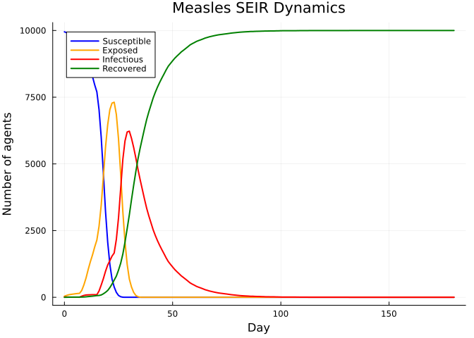
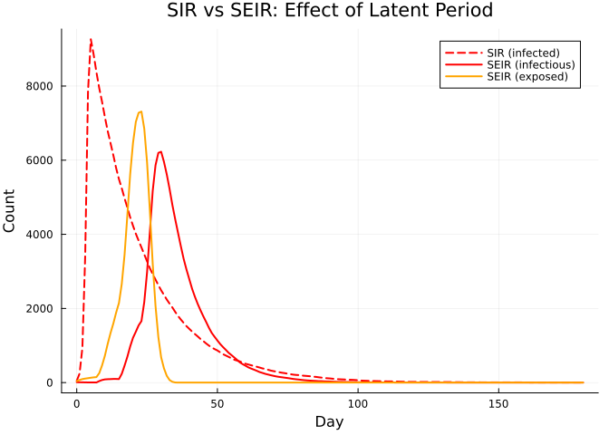
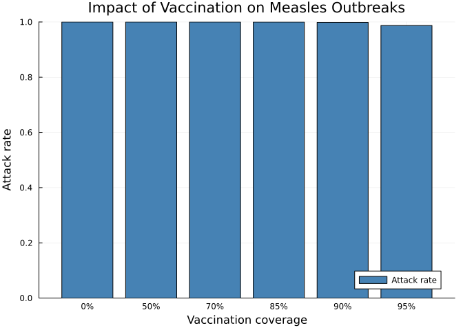
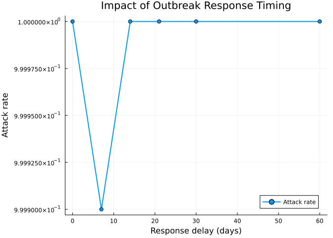

# Measles Outbreak Modeling with SEIR
Simon Frost

- [Overview](#overview)
- [A basic measles SEIR model](#a-basic-measles-seir-model)
- [Epidemic dynamics](#epidemic-dynamics)
- [Key epidemic metrics](#key-epidemic-metrics)
- [SIR vs SEIR comparison](#sir-vs-seir-comparison)
- [Vaccination scenarios](#vaccination-scenarios)
- [Outbreak response timing](#outbreak-response-timing)
- [Summary](#summary)

## Overview

Measles is a highly infectious viral disease with a basic reproduction
number (R₀) of 12–18. It follows an SEIR (Susceptible → Exposed →
Infectious → Recovered) pattern:

- **Incubation (exposed) period**: ~8–12 days
- **Infectious period**: ~6–11 days
- **Transmission probability**: Very high given contact

In this vignette, we model a measles outbreak using the `SEIR` disease
model in Starsim.jl, compare dynamics with and without vaccination, and
explore outbreak response timing.

## A basic measles SEIR model

``` julia
using Starsim
using Plots

# Measles parameters (CDC estimates)
sim = Sim(
    n_agents = 10_000,
    networks = RandomNet(n_contacts=15),  # high contact rate for measles
    diseases = SEIR(
        name = :measles,
        beta = 0.3,         # high transmission rate
        dur_exp = 8.0,      # 8 day incubation
        dur_inf = 11.0,     # 11 day infectious period
        init_prev = 0.001,  # seed with 10 cases
    ),
    dt = 1.0,
    stop = 180.0,   # 6 months
    rand_seed = 42,
    verbose = 0,
)
run!(sim)
```

    Sim(10000 agents, 0.0→180.0, dt=1.0, nets=1, dis=1, status=complete)

## Epidemic dynamics

``` julia
n_sus = get_result(sim, :measles, :n_susceptible)
n_exp = get_result(sim, :measles, :n_exposed)
n_inf = get_result(sim, :measles, :n_infected)
n_rec = get_result(sim, :measles, :n_recovered)

tvec = 0:length(n_sus)-1
plot(tvec, n_sus, label="Susceptible", lw=2, color=:blue)
plot!(tvec, n_exp, label="Exposed", lw=2, color=:orange)
plot!(tvec, n_inf, label="Infectious", lw=2, color=:red)
plot!(tvec, n_rec, label="Recovered", lw=2, color=:green)
xlabel!("Day")
ylabel!("Number of agents")
title!("Measles SEIR Dynamics")
```



## Key epidemic metrics

``` julia
prev = get_result(sim, :measles, :prevalence)

println("Peak prevalence: $(round(maximum(prev), digits=4))")
println("Peak day: $(argmax(prev))")
println("Attack rate: $(round(n_rec[end] / 10_000, digits=4))")
println("Final susceptible: $(Int(n_sus[end]))")
```

    Peak prevalence: 0.9023
    Peak day: 25
    Attack rate: 1.0
    Final susceptible: 0

## SIR vs SEIR comparison

The exposed (latent) period in SEIR delays the epidemic peak and reduces
its height compared to SIR with the same effective transmission rate.

``` julia
# SIR comparison (same beta, combine dur_exp + dur_inf for total duration)
sim_sir = Sim(
    n_agents = 10_000,
    networks = RandomNet(n_contacts=15),
    diseases = SIR(
        name = :measles_sir,
        beta = 0.3,
        dur_inf = 19.0,     # dur_exp + dur_inf
        init_prev = 0.001,
    ),
    dt = 1.0, stop = 180.0, rand_seed = 42, verbose = 0,
)
run!(sim_sir)

n_inf_sir = get_result(sim_sir, :measles_sir, :n_infected)
n_inf_seir = get_result(sim, :measles, :n_infected)
n_exp_seir = get_result(sim, :measles, :n_exposed)

plot(0:length(n_inf_sir)-1, n_inf_sir, label="SIR (infected)", lw=2, color=:red, ls=:dash)
plot!(0:length(n_inf_seir)-1, n_inf_seir, label="SEIR (infectious)", lw=2, color=:red)
plot!(0:length(n_exp_seir)-1, n_exp_seir, label="SEIR (exposed)", lw=2, color=:orange)
xlabel!("Day")
ylabel!("Count")
title!("SIR vs SEIR: Effect of Latent Period")
```



## Vaccination scenarios

Compare outbreak outcomes with different vaccination coverage levels.

``` julia
attack_rates = Float64[]
coverages = [0.0, 0.5, 0.7, 0.85, 0.9, 0.95]

for cov in coverages
    sim_v = Sim(
        n_agents = 10_000,
        networks = RandomNet(n_contacts=15),
        diseases = SEIR(
            name = :measles,
            beta = 0.3,
            dur_exp = 8.0,
            dur_inf = 11.0,
            init_prev = 0.001,
        ),
        dt = 1.0, stop = 180.0, rand_seed = 42, verbose = 0,
    )
    # Initialize
    init!(sim_v)

    # Pre-vaccinate: move fraction of susceptibles directly to recovered
    active = sim_v.people.auids.values
    disease = sim_v.diseases[:measles]
    sus_uids = [u for u in active if disease.infection.susceptible.raw[u]]
    n_vax = Int(round(cov * length(sus_uids)))
    if n_vax > 0
        vax_uids = UIDs(sus_uids[1:n_vax])
        disease.infection.susceptible[vax_uids] = false
        disease.recovered[vax_uids] = true
    end

    # Run remaining simulation
    run!(sim_v)
    ar = get_result(sim_v, :measles, :n_recovered)[end] / 10_000
    push!(attack_rates, ar)
    println("Coverage $(Int(cov*100))%: attack rate = $(round(ar, digits=4))")
end

bar(string.(Int.(coverages .* 100)) .* "%", attack_rates,
    label="Attack rate", color=:steelblue, ylabel="Attack rate",
    xlabel="Vaccination coverage", title="Impact of Vaccination on Measles Outbreaks")
```

    Coverage 0%: attack rate = 1.0
    Coverage 50%: attack rate = 1.0
    Coverage 70%: attack rate = 1.0
    Coverage 85%: attack rate = 0.9998
    Coverage 90%: attack rate = 0.9987
    Coverage 95%: attack rate = 0.9872



## Outbreak response timing

How quickly must we respond to an outbreak? We simulate triggering a
vaccination campaign at different days after the first detected case.

``` julia
response_days = [0, 7, 14, 21, 30, 60]
attack_rates_response = Float64[]

for delay in response_days
    sim_r = Sim(
        n_agents = 10_000,
        networks = RandomNet(n_contacts=15),
        diseases = SEIR(
            name = :measles,
            beta = 0.3,
            dur_exp = 8.0,
            dur_inf = 11.0,
            init_prev = 0.001,
        ),
        dt = 1.0, stop = 180.0, rand_seed = 42, verbose = 0,
    )
    init!(sim_r)

    # Run until response day, then vaccinate 80% of remaining susceptibles
    for ti in 1:sim_r.t.npts
        sim_r.loop.ti = ti
        for entry in sim_r.loop.steps
            entry.fn(sim_r)
        end
        if ti == delay
            disease = sim_r.diseases[:measles]
            sus = [u for u in sim_r.people.auids.values if disease.infection.susceptible.raw[u]]
            n_vax = Int(round(0.8 * length(sus)))
            if n_vax > 0
                vax_uids = UIDs(sus[1:n_vax])
                disease.infection.susceptible[vax_uids] = false
                disease.recovered[vax_uids] = true
            end
        end
    end

    sim_r.complete = true
    for (_, mod) in all_modules(sim_r)
        finalize!(mod)
    end

    ar = get_result(sim_r, :measles, :n_recovered)[end] / 10_000
    push!(attack_rates_response, ar)
    println("Response at day $delay: attack rate = $(round(ar, digits=4))")
end

plot(response_days, attack_rates_response, marker=:circle, lw=2,
    label="Attack rate", xlabel="Response delay (days)",
    ylabel="Attack rate", title="Impact of Outbreak Response Timing")
```

    Response at day 0: attack rate = 1.0
    Response at day 7: attack rate = 0.9999
    Response at day 14: attack rate = 1.0
    Response at day 21: attack rate = 1.0
    Response at day 30: attack rate = 1.0
    Response at day 60: attack rate = 1.0



## Summary

- Measles’ high R₀ requires very high vaccination coverage (\>95%) to
  prevent outbreaks
- The SEIR latent period delays peak compared to SIR
- Early outbreak response dramatically reduces attack rates
- Even a 1-week delay in response can significantly increase final
  outbreak size
