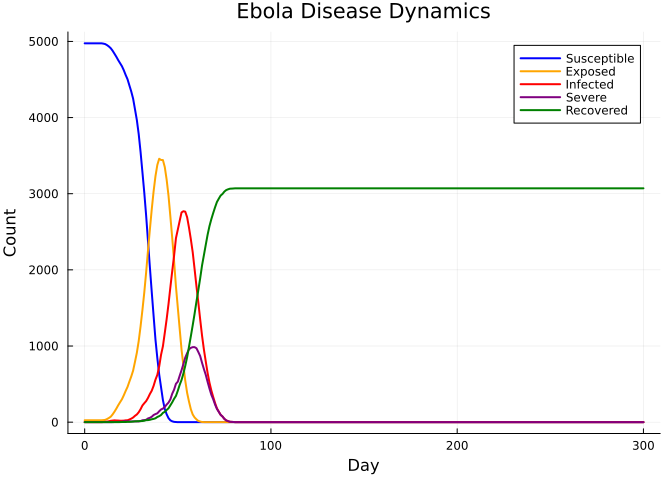
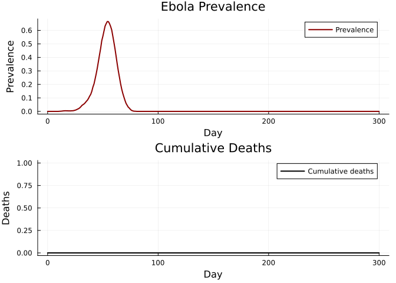

# Ebola: Severity-Structured Disease
Simon Frost

- [Overview](#overview)
- [Defining the Ebola disease](#defining-the-ebola-disease)
- [Running the simulation](#running-the-simulation)
- [Disease progression](#disease-progression)
- [Deaths and case fatality](#deaths-and-case-fatality)
- [Key metrics](#key-metrics)
- [Summary](#summary)

## Overview

Ebola virus disease (EVD) features multi-stage severity progression and
the unusual property of **dead-body transmission** — unsafe burials can
amplify outbreaks. This vignette implements a severity-structured Ebola
model following `starsim_examples/diseases/ebola.py`:

- Exposed → Symptomatic → Severe (70%) → Dead (55% of severe) /
  Recovered
- Unburied dead bodies transmit at 2.1× relative transmissibility
- Severe cases transmit at 2.2× relative transmissibility

## Defining the Ebola disease

``` julia
using Starsim
using Plots
using Random

mutable struct Ebola <: AbstractInfection
    infection::InfectionData

    # Disease states
    exposed::StateVector{Bool, Vector{Bool}}
    recovered::StateVector{Bool, Vector{Bool}}
    severe::StateVector{Bool, Vector{Bool}}
    buried::StateVector{Bool, Vector{Bool}}

    # Timepoint states
    ti_exposed::StateVector{Float64, Vector{Float64}}
    ti_recovered::StateVector{Float64, Vector{Float64}}
    ti_severe::StateVector{Float64, Vector{Float64}}
    ti_dead::StateVector{Float64, Vector{Float64}}
    ti_buried::StateVector{Float64, Vector{Float64}}

    # Parameters (all durations in days)
    dur_exp2symp::Float64
    dur_symp2sev::Float64
    dur_sev2dead::Float64
    dur_dead2buried::Float64
    dur_symp2rec::Float64
    dur_sev2rec::Float64
    p_sev::Float64
    p_death::Float64
    p_safe_bury::Float64
    sev_factor::Float64
    unburied_factor::Float64

    rng::StableRNG
end

function Ebola(;
    name::Symbol = :ebola,
    init_prev = 0.005,
    beta = 0.5,
    dur_exp2symp = 12.7,
    dur_symp2sev = 6.0,
    dur_sev2dead = 1.5,
    dur_dead2buried = 2.0,
    dur_symp2rec = 10.0,
    dur_sev2rec = 10.4,
    p_sev = 0.7,
    p_death = 0.55,
    p_safe_bury = 0.25,
    sev_factor = 2.2,
    unburied_factor = 2.1,
)
    inf = InfectionData(name; init_prev=init_prev, beta=beta, label="Ebola")

    Ebola(inf,
        BoolState(:exposed; default=false),
        BoolState(:recovered; default=false),
        BoolState(:severe; default=false),
        BoolState(:buried; default=false),
        FloatState(:ti_exposed; default=Inf),
        FloatState(:ti_recovered; default=Inf),
        FloatState(:ti_severe; default=Inf),
        FloatState(:ti_dead_ebola; default=Inf),
        FloatState(:ti_buried; default=Inf),
        Float64(dur_exp2symp), Float64(dur_symp2sev),
        Float64(dur_sev2dead), Float64(dur_dead2buried),
        Float64(dur_symp2rec), Float64(dur_sev2rec),
        Float64(p_sev), Float64(p_death), Float64(p_safe_bury),
        Float64(sev_factor), Float64(unburied_factor),
        StableRNG(0),
    )
end

Starsim.disease_data(d::Ebola) = d.infection.dd
Starsim.module_data(d::Ebola) = d.infection.dd.mod

function Starsim.init_pre!(d::Ebola, sim)
    md = module_data(d)
    md.t = Timeline(start=sim.pars.start, stop=sim.pars.stop, dt=sim.pars.dt)
    d.rng = StableRNG(hash(md.name) ⊻ sim.pars.rand_seed)

    all_states = [d.infection.susceptible, d.infection.infected,
                  d.infection.ti_infected, d.infection.rel_sus,
                  d.infection.rel_trans, d.exposed, d.recovered,
                  d.severe, d.buried, d.ti_exposed, d.ti_recovered,
                  d.ti_severe, d.ti_dead, d.ti_buried]
    for s in all_states
        add_module_state!(sim.people, s)
    end

    validate_beta!(d, sim)

    npts = md.t.npts
    define_results!(d,
        Result(:new_infections; npts=npts, label="New infections"),
        Result(:n_susceptible; npts=npts, scale=false),
        Result(:n_exposed; npts=npts, scale=false),
        Result(:n_infected; npts=npts, scale=false),
        Result(:n_severe; npts=npts, scale=false),
        Result(:n_recovered; npts=npts, scale=false),
        Result(:prevalence; npts=npts, scale=false),
        Result(:new_deaths; npts=npts),
    )
    md.initialized = true
    return d
end

function Starsim.validate_beta!(d::Ebola, sim)
    dd = disease_data(d)
    dt = sim.pars.dt
    if dd.beta isa Real
        for (name, _) in sim.networks
            dd.beta_per_dt[name] = 1.0 - exp(-Float64(dd.beta) * dt)
        end
    end
    return d
end

function Starsim.init_post!(d::Ebola, sim)
    people = sim.people
    active = people.auids.values
    n = length(active)
    n_infect = max(1, Int(round(d.infection.dd.init_prev * n)))
    infect_uids = UIDs(active[randperm(d.rng, n)[1:min(n_infect, n)]])

    for u in infect_uids.values
        d.infection.susceptible.raw[u] = false
        d.exposed.raw[u] = true
        d.ti_exposed.raw[u] = 1.0
        _set_ebola_prognosis!(d, u, 1)
    end
    return d
end

function _set_ebola_prognosis!(d::Ebola, uid::Int, ti::Int)
    ti_f = Float64(ti)
    d.infection.ti_infected.raw[uid] = ti_f + d.dur_exp2symp + randn(d.rng) * 2.0

    if rand(d.rng) < d.p_sev
        d.ti_severe.raw[uid] = d.infection.ti_infected.raw[uid] + d.dur_symp2sev + randn(d.rng) * 1.0
        if rand(d.rng) < d.p_death
            d.ti_dead.raw[uid] = d.ti_severe.raw[uid] + d.dur_sev2dead + randn(d.rng) * 0.5
            if rand(d.rng) < d.p_safe_bury
                d.ti_buried.raw[uid] = d.ti_dead.raw[uid]  # immediate safe burial
            else
                d.ti_buried.raw[uid] = d.ti_dead.raw[uid] + d.dur_dead2buried + randn(d.rng) * 0.5
            end
        else
            d.ti_recovered.raw[uid] = d.ti_severe.raw[uid] + d.dur_sev2rec + randn(d.rng) * 2.0
        end
    else
        d.ti_recovered.raw[uid] = d.infection.ti_infected.raw[uid] + d.dur_symp2rec + randn(d.rng) * 2.0
    end
    return
end

function Starsim.step_state!(d::Ebola, sim)
    ti = module_data(d).t.ti

    for u in sim.people.auids.values
        # Exposed -> infected
        if d.exposed.raw[u] && d.infection.ti_infected.raw[u] <= ti
            d.exposed.raw[u] = false
            d.infection.infected.raw[u] = true
        end

        # Infected -> severe
        if d.infection.infected.raw[u] && d.ti_severe.raw[u] <= ti
            d.severe.raw[u] = true
        end

        # Infected -> recovered
        if d.infection.infected.raw[u] && d.ti_recovered.raw[u] <= ti
            d.infection.infected.raw[u] = false
            d.recovered.raw[u] = true
        end

        # Severe -> recovered
        if d.severe.raw[u] && d.ti_recovered.raw[u] <= ti
            d.severe.raw[u] = false
            d.recovered.raw[u] = true
        end

        # Deaths
        if d.ti_dead.raw[u] <= ti && d.ti_dead.raw[u] != Inf
            request_death!(sim.people, UIDs([u]), ti)
        end

        # Burial
        if d.ti_buried.raw[u] <= ti
            d.buried.raw[u] = true
        end

        # Update rel_trans for severity and unburied dead
        if d.severe.raw[u]
            d.infection.rel_trans.raw[u] = d.sev_factor
        end
        if d.ti_dead.raw[u] <= ti && d.ti_buried.raw[u] > ti
            d.infection.rel_trans.raw[u] = d.unburied_factor
        end
    end

    return d
end

function Starsim.set_prognoses!(d::Ebola, target::Int, source::Int, sim)
    ti = module_data(d).t.ti
    d.infection.susceptible.raw[target] = false
    d.exposed.raw[target] = true
    d.ti_exposed.raw[target] = Float64(ti)
    _set_ebola_prognosis!(d, target, ti)
    push!(d.infection.infection_sources, (target, source, ti))
    return
end

function Starsim.step!(d::Ebola, sim)
    md = module_data(d)
    ti = md.t.ti
    dd = disease_data(d)
    new_infections = 0

    for (net_name, net) in sim.networks
        edges = network_edges(net)
        isempty(edges) && continue
        beta_dt = get(dd.beta_per_dt, net_name, 0.0)
        beta_dt == 0.0 && continue

        p1 = edges.p1; p2 = edges.p2; eb = edges.beta
        inf_raw = d.infection.infected.raw
        sus_raw = d.infection.susceptible.raw
        rt_raw = d.infection.rel_trans.raw
        rs_raw = d.infection.rel_sus.raw

        @inbounds for i in 1:length(edges)
            src, trg = p1[i], p2[i]
            if inf_raw[src] && sus_raw[trg]
                p = rt_raw[src] * rs_raw[trg] * beta_dt * eb[i]
                if rand(d.rng) < p
                    set_prognoses!(d, trg, src, sim)
                    new_infections += 1
                end
            end
            if inf_raw[trg] && sus_raw[src]
                p = rt_raw[trg] * rs_raw[src] * beta_dt * eb[i]
                if rand(d.rng) < p
                    set_prognoses!(d, src, trg, sim)
                    new_infections += 1
                end
            end
        end
    end
    return new_infections
end

function Starsim.step_die!(d::Ebola, death_uids::UIDs)
    d.infection.susceptible[death_uids] = false
    d.infection.infected[death_uids] = false
    d.exposed[death_uids] = false
    d.severe[death_uids] = false
    d.recovered[death_uids] = false
    return d
end

function Starsim.update_results!(d::Ebola, sim)
    md = module_data(d)
    ti = md.t.ti
    ti > length(md.results[:n_susceptible].values) && return d

    active = sim.people.auids.values
    n_sus = 0; n_exp = 0; n_inf = 0; n_sev = 0; n_rec = 0; n_dead = 0
    @inbounds for u in active
        n_sus += d.infection.susceptible.raw[u]
        n_exp += d.exposed.raw[u]
        n_inf += d.infection.infected.raw[u]
        n_sev += d.severe.raw[u]
        n_rec += d.recovered.raw[u]
        if d.ti_dead.raw[u] == Float64(ti) && d.ti_dead.raw[u] != Inf
            n_dead += 1
        end
    end
    n_total = Float64(length(active))

    md.results[:n_susceptible][ti] = Float64(n_sus)
    md.results[:n_exposed][ti] = Float64(n_exp)
    md.results[:n_infected][ti] = Float64(n_inf)
    md.results[:n_severe][ti] = Float64(n_sev)
    md.results[:n_recovered][ti] = Float64(n_rec)
    md.results[:prevalence][ti] = n_total > 0 ? n_inf / n_total : 0.0
    md.results[:new_deaths][ti] = Float64(n_dead)
    return d
end

function Starsim.finalize!(d::Ebola)
    md = module_data(d)
    for (target, source, ti) in d.infection.infection_sources
        if ti > 0 && ti <= length(md.results[:new_infections].values)
            md.results[:new_infections][ti] += 1.0
        end
    end
    return d
end
```

## Running the simulation

``` julia
sim = Sim(
    n_agents = 5_000,
    networks = RandomNet(n_contacts=5),
    diseases = Ebola(beta=0.5),
    dt = 1.0,
    stop = 300.0,
    rand_seed = 42,
    verbose = 0,
)
run!(sim)
```

    Sim(5000 agents, 0.0→300.0, dt=1.0, nets=1, dis=1, status=complete)

## Disease progression

``` julia
n_sus = get_result(sim, :ebola, :n_susceptible)
n_exp = get_result(sim, :ebola, :n_exposed)
n_inf = get_result(sim, :ebola, :n_infected)
n_sev = get_result(sim, :ebola, :n_severe)
n_rec = get_result(sim, :ebola, :n_recovered)
tvec = 0:length(n_sus)-1

plot(tvec, n_sus, label="Susceptible", lw=2, color=:blue)
plot!(tvec, n_exp, label="Exposed", lw=2, color=:orange)
plot!(tvec, n_inf, label="Infected", lw=2, color=:red)
plot!(tvec, n_sev, label="Severe", lw=2, color=:purple)
plot!(tvec, n_rec, label="Recovered", lw=2, color=:green)
xlabel!("Day")
ylabel!("Count")
title!("Ebola Disease Dynamics")
```



## Deaths and case fatality

``` julia
new_deaths = get_result(sim, :ebola, :new_deaths)
prev = get_result(sim, :ebola, :prevalence)

p1 = plot(tvec, prev, lw=2, color=:darkred, label="Prevalence")
ylabel!("Prevalence")
p2 = plot(tvec, cumsum(new_deaths), lw=2, color=:black, label="Cumulative deaths")
ylabel!("Deaths")
plot(p1, p2, layout=(2, 1), xlabel="Day",
     title=["Ebola Prevalence" "Cumulative Deaths"])
```



## Key metrics

``` julia
println("Peak prevalence: $(round(maximum(prev), digits=4))")
println("Peak day: $(argmax(prev))")
println("Total deaths: $(Int(sum(new_deaths)))")
println("Final recovered: $(Int(n_rec[end]))")
cfr = sum(new_deaths) / (sum(new_deaths) + n_rec[end])
println("Observed CFR: $(round(cfr, digits=3))")
```

    Peak prevalence: 0.6655
    Peak day: 55
    Total deaths: 0
    Final recovered: 3071
    Observed CFR: 0.0

## Summary

- Ebola’s multi-stage severity progression captures the clinical pathway
  (exposure → symptoms → severe → death or recovery)
- Dead-body transmission via unsafe burials amplifies the epidemic, with
  unburied bodies transmitting at 2.1× the base rate
- Severe cases also transmit more efficiently (2.2×), creating a
  positive feedback during the peak
- Safe burial interventions (`p_safe_bury`) directly reduce this
  amplification
