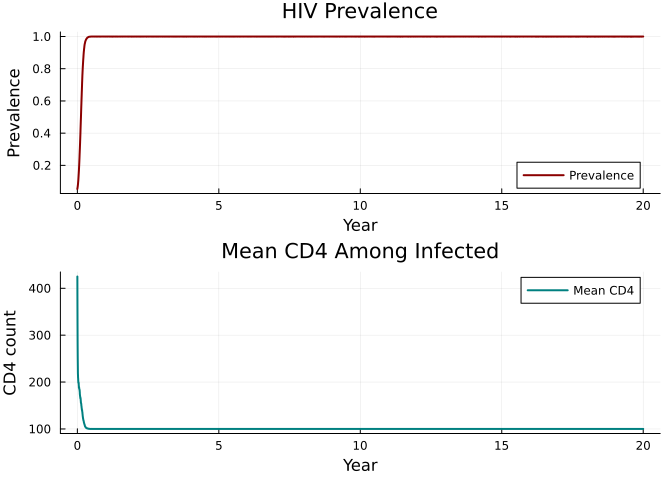

# HIV on Sexual Networks
Simon Frost

- [Overview](#overview)
- [Define the HIV disease](#define-the-hiv-disease)
- [Running an HIV simulation](#running-an-hiv-simulation)
- [HIV dynamics](#hiv-dynamics)
- [Key metrics](#key-metrics)
- [Summary](#summary)

## Overview

HIV is a sexually transmitted infection that requires structured sexual
networks for realistic modeling. This vignette demonstrates:

- HIV transmission on male-female sexual networks (`MFNet`)
- CD4 decline dynamics
- Antiretroviral therapy (ART) as an intervention
- CD4-dependent mortality

The model follows `starsim_examples/diseases/hiv.py`.

## Define the HIV disease

``` julia
using Starsim
using Plots
using Random

mutable struct HIV <: AbstractInfection
    infection::InfectionData

    # HIV-specific states
    on_art::StateVector{Bool, Vector{Bool}}
    ti_art::StateVector{Float64, Vector{Float64}}
    ti_dead_hiv::StateVector{Float64, Vector{Float64}}
    cd4::StateVector{Float64, Vector{Float64}}

    # Parameters
    cd4_min::Float64
    cd4_max::Float64
    cd4_rate::Float64
    art_efficacy::Float64
    p_death::Float64

    rng::StableRNG
end

function HIV(;
    name::Symbol = :hiv,
    init_prev = 0.05,
    beta = Dict(:mf => 0.08),
    cd4_min = 100.0,
    cd4_max = 500.0,
    cd4_rate = 5.0,
    art_efficacy = 0.96,
    p_death = 0.05 / 365,
)
    inf = InfectionData(name; init_prev=init_prev, beta=beta, label="HIV")

    HIV(inf,
        BoolState(:on_art; default=false),
        FloatState(:ti_art; default=Inf),
        FloatState(:ti_dead_hiv; default=Inf),
        FloatState(:cd4; default=500.0),
        Float64(cd4_min), Float64(cd4_max), Float64(cd4_rate),
        Float64(art_efficacy), Float64(p_death),
        StableRNG(0),
    )
end

Starsim.disease_data(d::HIV) = d.infection.dd
Starsim.module_data(d::HIV) = d.infection.dd.mod

function Starsim.init_pre!(d::HIV, sim)
    md = module_data(d)
    md.t = Timeline(start=sim.pars.start, stop=sim.pars.stop, dt=sim.pars.dt)
    d.rng = StableRNG(hash(md.name) ⊻ sim.pars.rand_seed)

    all_states = [d.infection.susceptible, d.infection.infected,
                  d.infection.ti_infected, d.infection.rel_sus,
                  d.infection.rel_trans, d.on_art, d.ti_art,
                  d.ti_dead_hiv, d.cd4]
    for s in all_states
        add_module_state!(sim.people, s)
    end

    validate_beta!(d, sim)

    npts = md.t.npts
    define_results!(d,
        Result(:new_infections; npts=npts),
        Result(:n_susceptible; npts=npts, scale=false),
        Result(:n_infected; npts=npts, scale=false),
        Result(:prevalence; npts=npts, scale=false),
        Result(:new_deaths; npts=npts),
        Result(:mean_cd4; npts=npts, scale=false),
        Result(:n_on_art; npts=npts, scale=false),
    )
    md.initialized = true
    return d
end

function Starsim.validate_beta!(d::HIV, sim)
    dd = disease_data(d)
    dt = sim.pars.dt
    if dd.beta isa Dict
        for (name, b) in dd.beta
            dd.beta_per_dt[Symbol(name)] = 1.0 - exp(-Float64(b) * dt)
        end
    elseif dd.beta isa Real
        for (name, _) in sim.networks
            dd.beta_per_dt[name] = 1.0 - exp(-Float64(dd.beta) * dt)
        end
    end
    return d
end

function Starsim.init_post!(d::HIV, sim)
    people = sim.people
    active = people.auids.values
    n = length(active)
    n_infect = max(1, Int(round(d.infection.dd.init_prev * n)))
    infect_uids = UIDs(active[randperm(d.rng, n)[1:min(n_infect, n)]])

    d.infection.susceptible[infect_uids] = false
    d.infection.infected[infect_uids] = true
    d.infection.ti_infected.raw[infect_uids.values] .= 1.0
    return d
end

function Starsim.step_state!(d::HIV, sim)
    ti = module_data(d).t.ti

    # CD4 dynamics
    for u in sim.people.auids.values
        if d.infection.infected.raw[u] && sim.people.alive.raw[u]
            if d.on_art.raw[u]
                d.cd4.raw[u] += (d.cd4_max - d.cd4.raw[u]) / d.cd4_rate
                d.infection.rel_trans.raw[u] = 1.0 - d.art_efficacy
            else
                d.cd4.raw[u] += (d.cd4_min - d.cd4.raw[u]) / d.cd4_rate
            end

            # CD4-dependent mortality
            scale = (d.cd4.raw[u] - d.cd4_max)^2 / (d.cd4_min - d.cd4_max)^2
            if rand(d.rng) < d.p_death * scale
                request_death!(sim.people, UIDs([u]), ti)
                d.ti_dead_hiv.raw[u] = Float64(ti)
            end
        end
    end
    return d
end

function Starsim.set_prognoses!(d::HIV, target::Int, source::Int, sim)
    ti = module_data(d).t.ti
    d.infection.susceptible.raw[target] = false
    d.infection.infected.raw[target] = true
    d.infection.ti_infected.raw[target] = Float64(ti)
    push!(d.infection.infection_sources, (target, source, ti))
    return
end

function Starsim.step!(d::HIV, sim)
    md = module_data(d)
    ti = md.t.ti
    dd = disease_data(d)
    new_infections = 0

    for (net_name, net) in sim.networks
        edges = network_edges(net)
        isempty(edges) && continue
        beta_dt = get(dd.beta_per_dt, net_name, 0.0)
        beta_dt == 0.0 && continue

        p1 = edges.p1; p2 = edges.p2; eb = edges.beta
        inf_raw = d.infection.infected.raw
        sus_raw = d.infection.susceptible.raw
        rt_raw = d.infection.rel_trans.raw
        rs_raw = d.infection.rel_sus.raw

        @inbounds for i in 1:length(edges)
            src, trg = p1[i], p2[i]
            if inf_raw[src] && sus_raw[trg]
                p = rt_raw[src] * rs_raw[trg] * beta_dt * eb[i]
                if rand(d.rng) < p
                    set_prognoses!(d, trg, src, sim)
                    new_infections += 1
                end
            end
            if inf_raw[trg] && sus_raw[src]
                p = rt_raw[trg] * rs_raw[src] * beta_dt * eb[i]
                if rand(d.rng) < p
                    set_prognoses!(d, src, trg, sim)
                    new_infections += 1
                end
            end
        end
    end
    return new_infections
end

function Starsim.step_die!(d::HIV, death_uids::UIDs)
    d.infection.susceptible[death_uids] = false
    d.infection.infected[death_uids] = false
    d.on_art[death_uids] = false
    return d
end

function Starsim.update_results!(d::HIV, sim)
    md = module_data(d)
    ti = md.t.ti
    ti > length(md.results[:n_susceptible].values) && return d

    active = sim.people.auids.values
    n_sus = 0; n_inf = 0; n_art = 0; n_dead = 0
    cd4_sum = 0.0; n_cd4 = 0
    @inbounds for u in active
        n_sus += d.infection.susceptible.raw[u]
        n_inf += d.infection.infected.raw[u]
        n_art += d.on_art.raw[u]
        if d.ti_dead_hiv.raw[u] == Float64(ti)
            n_dead += 1
        end
        if d.infection.infected.raw[u]
            cd4_sum += d.cd4.raw[u]
            n_cd4 += 1
        end
    end
    n_total = Float64(length(active))

    md.results[:n_susceptible][ti] = Float64(n_sus)
    md.results[:n_infected][ti] = Float64(n_inf)
    md.results[:prevalence][ti] = n_total > 0 ? n_inf / n_total : 0.0
    md.results[:new_deaths][ti] = Float64(n_dead)
    md.results[:mean_cd4][ti] = n_cd4 > 0 ? cd4_sum / n_cd4 : 0.0
    md.results[:n_on_art][ti] = Float64(n_art)
    return d
end

function Starsim.finalize!(d::HIV)
    md = module_data(d)
    for (target, source, ti) in d.infection.infection_sources
        if ti > 0 && ti <= length(md.results[:new_infections].values)
            md.results[:new_infections][ti] += 1.0
        end
    end
    return d
end
```

## Running an HIV simulation

``` julia
sim = Sim(
    n_agents = 5_000,
    networks = MFNet(participation_rate=0.8),
    diseases = HIV(beta=Dict(:mf => 0.08)),
    dt = 1.0,
    stop = 365.0 * 20,  # 20 years
    rand_seed = 42,
    verbose = 0,
)
run!(sim)
```

    Sim(5000 agents, 0.0→7300.0, dt=1.0, nets=1, dis=1, status=complete)

## HIV dynamics

``` julia
prev = get_result(sim, :hiv, :prevalence)
n_inf = get_result(sim, :hiv, :n_infected)
mean_cd4 = get_result(sim, :hiv, :mean_cd4)
tvec = (0:length(prev)-1) ./ 365

p1 = plot(tvec, prev, lw=2, color=:darkred, label="Prevalence", ylabel="Prevalence")
p2 = plot(tvec, mean_cd4, lw=2, color=:teal, label="Mean CD4", ylabel="CD4 count")
plot(p1, p2, layout=(2, 1), xlabel="Year",
     title=["HIV Prevalence" "Mean CD4 Among Infected"])
```



## Key metrics

``` julia
new_deaths = get_result(sim, :hiv, :new_deaths)
println("Final prevalence: $(round(prev[end], digits=4))")
println("Peak infected: $(Int(maximum(n_inf)))")
println("Total HIV deaths: $(Int(sum(new_deaths)))")
println("Final mean CD4: $(round(mean_cd4[end], digits=1))")
```

    Final prevalence: 1.0
    Peak infected: 4927
    Total HIV deaths: 3155
    Final mean CD4: 100.0

## Summary

- HIV on sexual networks shows gradual epidemic buildup driven by
  partnership formation
- Without ART, CD4 counts decline steadily toward the minimum,
  increasing mortality
- CD4-dependent mortality creates nonlinear dynamics: as the epidemic
  matures, infected individuals die faster
- The `MFNet` network constrains transmission to male-female pairs,
  capturing sexual network structure
