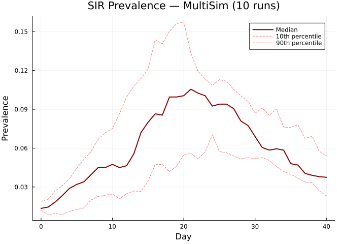
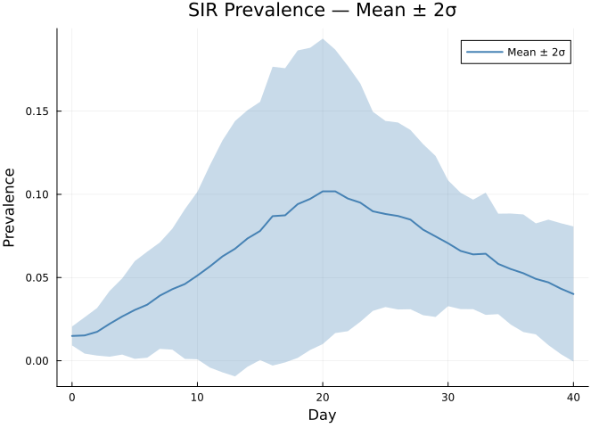
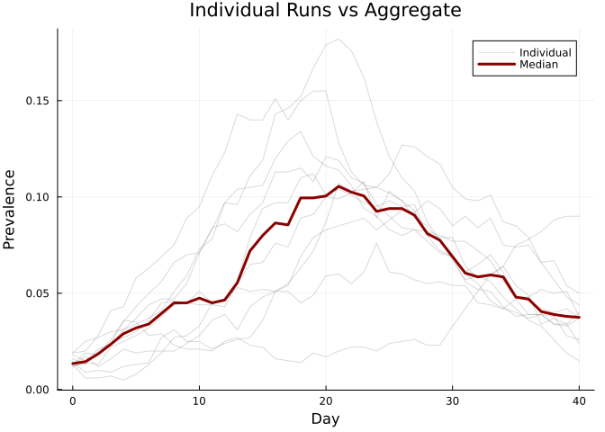

# MultiSim: Parallel Runs and Uncertainty
Simon Frost

- [Overview](#overview)
- [Basic MultiSim](#basic-multisim)
- [Reduced results (median +
  quantiles)](#reduced-results-median--quantiles)
- [Mean-based reduction](#mean-based-reduction)
- [Accessing raw results](#accessing-raw-results)
- [Individual run comparison](#individual-run-comparison)
- [Summary](#summary)

## Overview

Stochastic simulations produce different outcomes each run. `MultiSim`
runs multiple replications and aggregates results to quantify
uncertainty. Unlike Python starsim (limited by the GIL), Julia’s
`MultiSim` uses true multi-threading via `Threads.@threads`.

## Basic MultiSim

``` julia
using Starsim
using Plots

n_contacts = 10
beta = 0.5 / n_contacts

base = Sim(
    n_agents = 1_000,
    networks = RandomNet(n_contacts=n_contacts),
    diseases = SIR(beta=beta, dur_inf=4.0, init_prev=0.01),
    dt = 1.0,
    stop = 40.0,
    rand_seed = 42,
    verbose = 0,
)

msim = MultiSim(base, n_runs=10)
run!(msim; verbose=0)
println(msim)
```

    MultiSim(n_runs=10, status=complete, threads=1)

## Reduced results (median + quantiles)

The default `reduce!` computes the median with 10th/90th percentile
bounds.

``` julia
reduce!(msim)

key = :sir_prevalence
rr = msim.reduced[key]
tvec = 0:length(rr.values)-1

plot(tvec, rr.values, lw=2, color=:darkred, label="Median")
plot!(tvec, rr.low, lw=1, ls=:dash, color=:red, alpha=0.5, label="10th percentile")
plot!(tvec, rr.high, lw=1, ls=:dash, color=:red, alpha=0.5, label="90th percentile")
xlabel!("Day")
ylabel!("Prevalence")
title!("SIR Prevalence — MultiSim (10 runs)")
```



## Mean-based reduction

`mean!` uses mean ± k×σ bounds (default k=2).

``` julia
mean!(msim; bounds=2.0)

rr = msim.reduced[:sir_prevalence]
tvec = 0:length(rr.values)-1

plot(tvec, rr.values, ribbon=(rr.values .- rr.low, rr.high .- rr.values),
     fillalpha=0.3, lw=2, color=:steelblue, label="Mean ± 2σ")
xlabel!("Day")
ylabel!("Prevalence")
title!("SIR Prevalence — Mean ± 2σ")
```



## Accessing raw results

Raw results are stored as `npts × n_runs` matrices.

``` julia
prev_mat = msim.results[:sir_prevalence]
println("Shape: $(size(prev_mat)) ($(size(prev_mat,1)) timesteps × $(size(prev_mat,2)) runs)")
println("Available keys: $(result_keys(msim))")
```

    Shape: (41, 10) (41 timesteps × 10 runs)
    Available keys: [:sir_prevalence, :sir_new_infections, :sir_n_susceptible, :sir_n_recovered, :sir_n_infected]

## Individual run comparison

``` julia
prev_mat = msim.results[:sir_prevalence]
tvec = 0:size(prev_mat, 1)-1

p = plot(xlabel="Day", ylabel="Prevalence", title="Individual Runs vs Aggregate")
for j in 1:msim.n_runs
    plot!(p, tvec, prev_mat[:, j], alpha=0.3, color=:gray, label=(j==1 ? "Individual" : ""))
end

reduce!(msim)
rr = msim.reduced[:sir_prevalence]
plot!(p, tvec, rr.values, lw=3, color=:darkred, label="Median")
p
```



## Summary

- `MultiSim` automates running multiple stochastic replications
- Each run gets a unique random seed derived from the base
- `reduce!` provides median + quantile bounds; `mean!` provides mean ±
  k×σ
- Julia threads give true parallelism — no GIL limitation
- Raw results accessible as matrices for custom analysis
