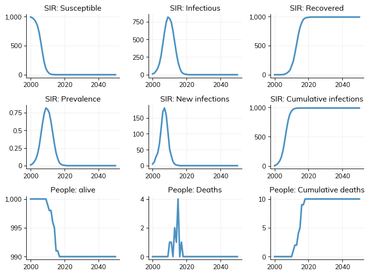
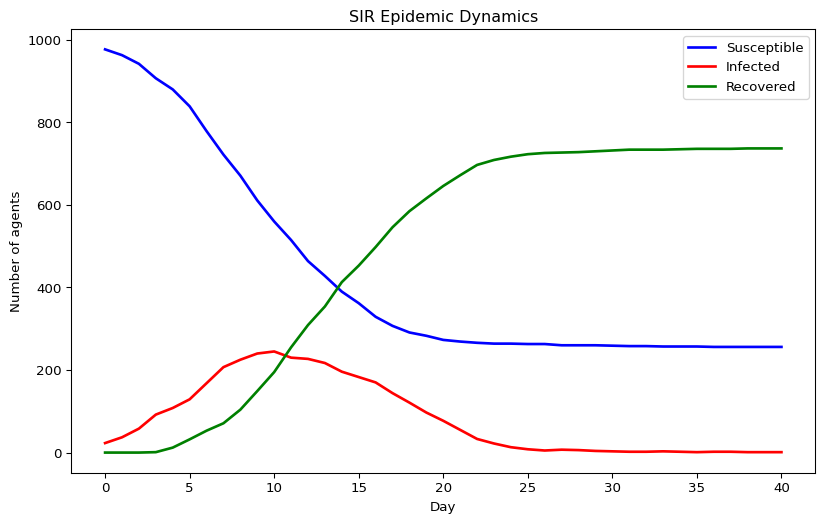

# Introduction to Starsim (Python)
Simon Frost

- [Overview](#overview)
- [Quick start](#quick-start)
- [Building a basic SIR model](#building-a-basic-sir-model)
- [Accessing results](#accessing-results)
- [Exporting to DataFrame](#exporting-to-dataframe)
- [Plotting the epidemic curve](#plotting-the-epidemic-curve)

## Overview

This is the Python companion to the Julia `01_introduction` vignette,
using the [Starsim](https://starsim.org) framework.

## Quick start

``` python
import starsim as ss

sim = ss.demo(n_agents=1000)
```


    —————————————
    Running demo:
    —————————————

    Initializing sim with 1000 agents

      Running 2000.01.01 ( 0/51) (0.00 s)  ———————————————————— 2%

      Running 2010.01.01 (10/51) (0.14 s)  ••••———————————————— 22%

      Running 2020.01.01 (20/51) (0.15 s)  ••••••••———————————— 41%

      Running 2030.01.01 (30/51) (0.16 s)  ••••••••••••———————— 61%

      Running 2040.01.01 (40/51) (0.17 s)  ••••••••••••••••———— 80%

      Running 2050.01.01 (50/51) (0.18 s)  •••••••••••••••••••• 100%


    ——————————
    Results:
    ——————————

    #0. 'randomnet_n_edges':  4964.509803921569
    #1. 'sir_n_susceptible':  134.4313725490196
    #2. 'sir_n_infected':     127.13725490196079
    #3. 'sir_n_recovered':    731.1372549019608
    #4. 'sir_prevalence':     0.12726683796619787
    #5. 'sir_new_infections': 19.431372549019606
    #6. 'sir_cum_infections': 991.0
    #7. 'n_alive':            992.7058823529412
    #8. 'n_female':           0.0
    #9. 'new_deaths':         0.19607843137254902
    #10. 'new_emigrants':      0.0
    #11. 'cum_deaths':         10.0
    Figure(768x576)



## Building a basic SIR model

``` python
n_contacts = 10
beta = 0.5 / n_contacts  # R₀ ≈ beta × n_contacts × dur_inf = 2

sim = ss.Sim(
    n_agents=1_000,
    networks=ss.RandomNet(n_contacts=n_contacts),
    diseases=ss.SIR(beta=beta, dur_inf=4, init_prev=0.01),
    dt=1.0,
    start=0,
    stop=40,
    rand_seed=42,
    verbose=0,
)
sim.run()
```

    Sim(n=1000; 0—40; networks=randomnet; diseases=sir)

## Accessing results

``` python
n_sus = sim.results.sir.n_susceptible.values
n_inf = sim.results.sir.n_infected.values
n_rec = sim.results.sir.n_recovered.values
prev = sim.results.sir.prevalence.values

print(f"Peak prevalence: {max(prev):.4f}")
print(f"Final susceptible: {int(n_sus[-1])}")
print(f"Final recovered: {int(n_rec[-1])}")
```

    Peak prevalence: 0.2450
    Final susceptible: 256
    Final recovered: 737

## Exporting to DataFrame

``` python
df = sim.to_df()
print(f"Columns: {list(df.columns)[:10]}...")
print(f"Rows: {len(df)}")
df.head()
```

    Columns: ['timevec', 'randomnet_n_edges', 'sir_n_susceptible', 'sir_n_infected', 'sir_n_recovered', 'sir_prevalence', 'sir_new_infections', 'sir_cum_infections', 'n_alive', 'n_female']...
    Rows: 41

<div>
<style scoped>
    .dataframe tbody tr th:only-of-type {
        vertical-align: middle;
    }
&#10;    .dataframe tbody tr th {
        vertical-align: top;
    }
&#10;    .dataframe thead th {
        text-align: right;
    }
</style>

|  | timevec | randomnet_n_edges | sir_n_susceptible | sir_n_infected | sir_n_recovered | sir_prevalence | sir_new_infections | sir_cum_infections | n_alive | n_female | new_deaths | new_emigrants | cum_deaths |
|----|----|----|----|----|----|----|----|----|----|----|----|----|----|
| 0 | 0.0 | 5000.0 | 977.0 | 23.0 | 0.0 | 0.023 | 10.0 | 10.0 | 1000.0 | 0.0 | 0.0 | 0.0 | 0.0 |
| 1 | 1.0 | 5000.0 | 963.0 | 37.0 | 0.0 | 0.037 | 14.0 | 24.0 | 1000.0 | 0.0 | 0.0 | 0.0 | 0.0 |
| 2 | 2.0 | 5000.0 | 942.0 | 58.0 | 0.0 | 0.058 | 21.0 | 45.0 | 1000.0 | 0.0 | 0.0 | 0.0 | 0.0 |
| 3 | 3.0 | 5000.0 | 907.0 | 92.0 | 1.0 | 0.092 | 35.0 | 80.0 | 1000.0 | 0.0 | 0.0 | 0.0 | 0.0 |
| 4 | 4.0 | 5000.0 | 880.0 | 108.0 | 12.0 | 0.108 | 27.0 | 107.0 | 1000.0 | 0.0 | 0.0 | 0.0 | 0.0 |

</div>

## Plotting the epidemic curve

``` python
import pylab as pl

tvec = range(len(n_sus))
pl.figure(figsize=(10, 6))
pl.plot(tvec, n_sus, label="Susceptible", lw=2, color="blue")
pl.plot(tvec, n_inf, label="Infected", lw=2, color="red")
pl.plot(tvec, n_rec, label="Recovered", lw=2, color="green")
pl.xlabel("Day")
pl.ylabel("Number of agents")
pl.title("SIR Epidemic Dynamics")
pl.legend()
pl.show()
```


