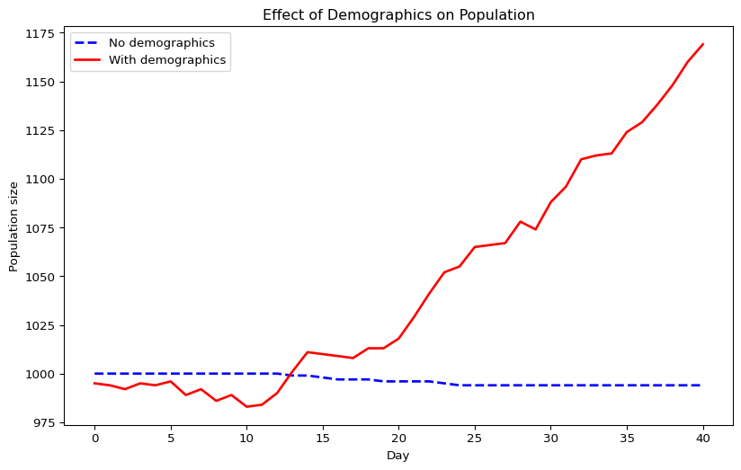
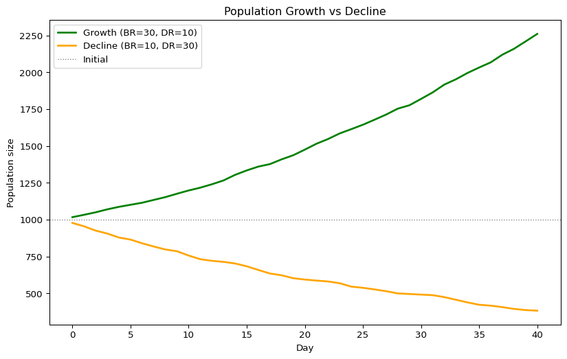
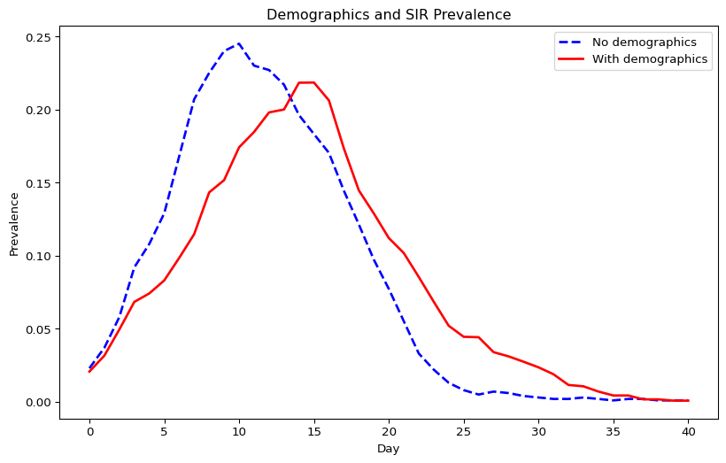
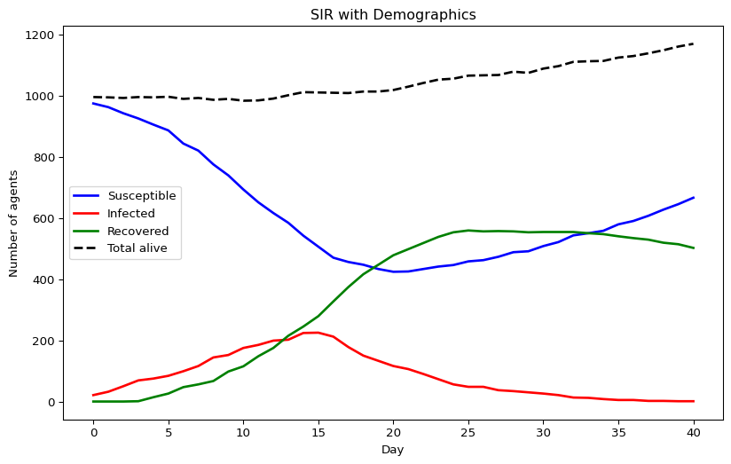

# Demographics (Python)
Simon Frost

- [Overview](#overview)
- [A simulation without
  demographics](#a-simulation-without-demographics)
- [Adding births and deaths](#adding-births-and-deaths)
- [Visualizing population change](#visualizing-population-change)
- [Population growth vs decline](#population-growth-vs-decline)
- [Impact of demographics on disease
  dynamics](#impact-of-demographics-on-disease-dynamics)
- [Epidemic curves with
  demographics](#epidemic-curves-with-demographics)

## Overview

This is the Python companion to the Julia `03_demographics` vignette,
demonstrating births, deaths, and aging using the Starsim framework.

## A simulation without demographics

``` python
import starsim as ss
import numpy as np

n_contacts = 10
beta = 0.5 / n_contacts

sim_base = ss.Sim(
    n_agents=1_000,
    networks=ss.RandomNet(n_contacts=n_contacts),
    diseases=ss.SIR(beta=beta, dur_inf=4, init_prev=0.01),
    dt=1.0,
    start=0,
    stop=40,
    rand_seed=42,
    verbose=0,
)
sim_base.run()

n_alive_base = sim_base.results.n_alive.values
print(f"Population (no demographics): {int(n_alive_base[0])} → {int(n_alive_base[-1])}")
```

    Population (no demographics): 1000 → 994

## Adding births and deaths

``` python
sim_demo = ss.Sim(
    n_agents=1_000,
    networks=ss.RandomNet(n_contacts=n_contacts),
    diseases=ss.SIR(beta=beta, dur_inf=4, init_prev=0.01),
    demographics=[ss.Births(birth_rate=20), ss.Deaths(death_rate=15)],
    dt=1.0,
    start=0,
    stop=40,
    rand_seed=42,
    verbose=0,
)
sim_demo.run()

n_alive_demo = sim_demo.results.n_alive.values
print(f"Population (with demographics): {int(n_alive_demo[0])} → {int(n_alive_demo[-1])}")
```

    Population (with demographics): 995 → 1169

## Visualizing population change

``` python
import pylab as pl

pl.figure(figsize=(10, 6))
pl.plot(range(len(n_alive_base)), n_alive_base, label="No demographics", lw=2, color="blue", ls="--")
pl.plot(range(len(n_alive_demo)), n_alive_demo, label="With demographics", lw=2, color="red")
pl.xlabel("Day")
pl.ylabel("Population size")
pl.title("Effect of Demographics on Population")
pl.legend()
pl.show()
```



## Population growth vs decline

``` python
sim_grow = ss.Sim(
    n_agents=1_000,
    networks=ss.RandomNet(n_contacts=n_contacts),
    diseases=ss.SIR(beta=beta, dur_inf=4, init_prev=0.01),
    demographics=[ss.Births(birth_rate=30), ss.Deaths(death_rate=10)],
    dt=1.0, start=0, stop=40, rand_seed=42, verbose=0,
)
sim_grow.run()

sim_decline = ss.Sim(
    n_agents=1_000,
    networks=ss.RandomNet(n_contacts=n_contacts),
    diseases=ss.SIR(beta=beta, dur_inf=4, init_prev=0.01),
    demographics=[ss.Births(birth_rate=10), ss.Deaths(death_rate=30)],
    dt=1.0, start=0, stop=40, rand_seed=42, verbose=0,
)
sim_decline.run()

n_grow = sim_grow.results.n_alive.values
n_decline = sim_decline.results.n_alive.values

pl.figure(figsize=(10, 6))
pl.plot(range(len(n_grow)), n_grow, label="Growth (BR=30, DR=10)", lw=2, color="green")
pl.plot(range(len(n_decline)), n_decline, label="Decline (BR=10, DR=30)", lw=2, color="orange")
pl.axhline(1000, label="Initial", lw=1, ls=":", color="gray")
pl.xlabel("Day")
pl.ylabel("Population size")
pl.title("Population Growth vs Decline")
pl.legend()
pl.show()
```



## Impact of demographics on disease dynamics

``` python
prev_base = sim_base.results.sir.prevalence.values
prev_demo = sim_demo.results.sir.prevalence.values

pl.figure(figsize=(10, 6))
pl.plot(range(len(prev_base)), prev_base, label="No demographics", lw=2, color="blue", ls="--")
pl.plot(range(len(prev_demo)), prev_demo, label="With demographics", lw=2, color="red")
pl.xlabel("Day")
pl.ylabel("Prevalence")
pl.title("Demographics and SIR Prevalence")
pl.legend()
pl.show()
```



## Epidemic curves with demographics

``` python
n_sus = sim_demo.results.sir.n_susceptible.values
n_inf = sim_demo.results.sir.n_infected.values
n_rec = sim_demo.results.sir.n_recovered.values

pl.figure(figsize=(10, 6))
pl.plot(range(len(n_sus)), n_sus, label="Susceptible", lw=2, color="blue")
pl.plot(range(len(n_inf)), n_inf, label="Infected", lw=2, color="red")
pl.plot(range(len(n_rec)), n_rec, label="Recovered", lw=2, color="green")
pl.plot(range(len(n_alive_demo)), n_alive_demo, label="Total alive", lw=2, color="black", ls="--")
pl.xlabel("Day")
pl.ylabel("Number of agents")
pl.title("SIR with Demographics")
pl.legend()
pl.show()
```


