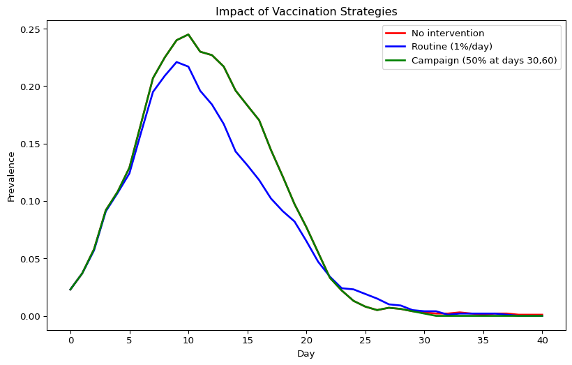
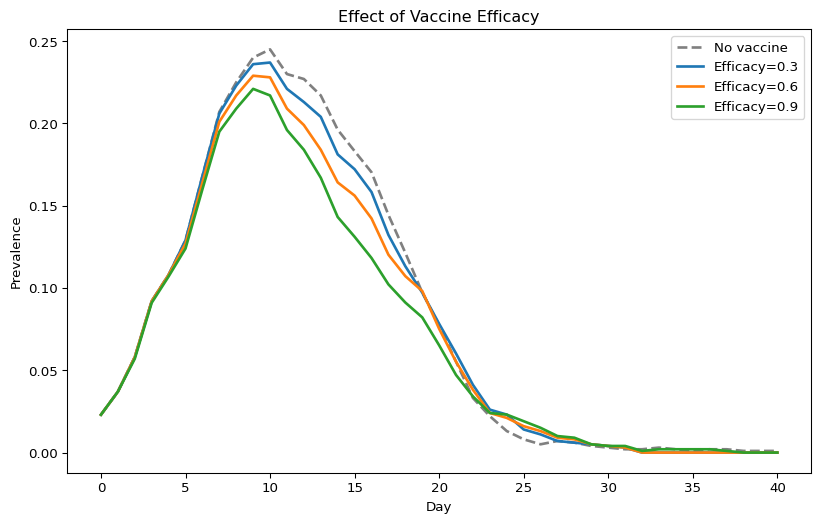
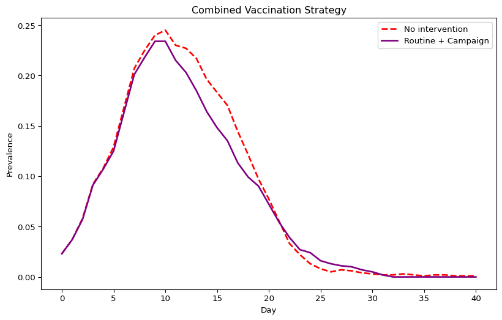

# Interventions (Python)
Simon Frost

- [Overview](#overview)
- [Baseline: no intervention](#baseline-no-intervention)
- [Routine delivery](#routine-delivery)
- [Campaign delivery](#campaign-delivery)
- [Comparing baseline vs
  interventions](#comparing-baseline-vs-interventions)
- [Varying vaccine efficacy](#varying-vaccine-efficacy)
- [Combining routine and campaign
  delivery](#combining-routine-and-campaign-delivery)

## Overview

This is the Python companion to the Julia `06_interventions` vignette,
demonstrating vaccination with routine and campaign delivery in Starsim.

## Baseline: no intervention

``` python
import starsim as ss
import numpy as np
import pylab as pl

n_contacts = 10
beta = 0.5 / n_contacts

sim_base = ss.Sim(
    n_agents=1_000,
    networks=ss.RandomNet(n_contacts=n_contacts),
    diseases=ss.SIR(beta=beta, dur_inf=4, init_prev=0.01),
    dt=1.0, start=0, stop=40, rand_seed=42, verbose=0,
)
sim_base.run()

prev_base = sim_base.results.sir.prevalence.values
print(f"Baseline peak prevalence: {max(prev_base):.4f}")
```

    Baseline peak prevalence: 0.2450

## Routine delivery

``` python
vaccine = ss.simple_vx(efficacy=0.9)
routine = ss.routine_vx(product=vaccine, prob=0.01)

sim_routine = ss.Sim(
    n_agents=1_000,
    networks=ss.RandomNet(n_contacts=n_contacts),
    diseases=ss.SIR(beta=beta, dur_inf=4, init_prev=0.01),
    interventions=routine,
    dt=1.0, start=0, stop=40, rand_seed=42, verbose=0,
)
sim_routine.run()

prev_routine = sim_routine.results.sir.prevalence.values
print(f"Routine vaccination peak prevalence: {max(prev_routine):.4f}")
```

    Routine vaccination peak prevalence: 0.2210

## Campaign delivery

``` python
campaign = ss.campaign_vx(
    product=vaccine,
    prob=0.5,
    years=[30, 60],
)

sim_campaign = ss.Sim(
    n_agents=1_000,
    networks=ss.RandomNet(n_contacts=n_contacts),
    diseases=ss.SIR(beta=beta, dur_inf=4, init_prev=0.01),
    interventions=campaign,
    dt=1.0, start=0, stop=40, rand_seed=42, verbose=0,
)
sim_campaign.run()

prev_campaign = sim_campaign.results.sir.prevalence.values
print(f"Campaign vaccination peak prevalence: {max(prev_campaign):.4f}")
```

    Campaign vaccination peak prevalence: 0.2450

## Comparing baseline vs interventions

``` python
pl.figure(figsize=(10, 6))
pl.plot(range(len(prev_base)),     prev_base,     label="No intervention",              lw=2, color="red")
pl.plot(range(len(prev_routine)),  prev_routine,  label="Routine (1%/day)",             lw=2, color="blue")
pl.plot(range(len(prev_campaign)), prev_campaign, label="Campaign (50% at days 30,60)", lw=2, color="green")
pl.xlabel("Day")
pl.ylabel("Prevalence")
pl.title("Impact of Vaccination Strategies")
pl.legend()
pl.show()
```



## Varying vaccine efficacy

``` python
efficacies = [0.3, 0.6, 0.9]

pl.figure(figsize=(10, 6))
pl.plot(range(len(prev_base)), prev_base, label="No vaccine", lw=2, color="gray", ls="--")

for eff in efficacies:
    vx = ss.simple_vx(efficacy=eff)
    delivery = ss.routine_vx(product=vx, prob=0.01)
    sim = ss.Sim(
        n_agents=1_000, networks=ss.RandomNet(n_contacts=n_contacts),
        diseases=ss.SIR(beta=beta, dur_inf=4, init_prev=0.01),
        interventions=delivery,
        dt=1.0, start=0, stop=40, rand_seed=42, verbose=0,
    )
    sim.run()
    prev = sim.results.sir.prevalence.values
    pl.plot(range(len(prev)), prev, label=f"Efficacy={eff}", lw=2)

pl.xlabel("Day")
pl.ylabel("Prevalence")
pl.title("Effect of Vaccine Efficacy")
pl.legend()
pl.show()
```



## Combining routine and campaign delivery

``` python
vx = ss.simple_vx(efficacy=0.9)
combined = [
    ss.routine_vx(product=vx, prob=0.005),
    ss.campaign_vx(product=vx, prob=0.3, years=[50]),
]

sim_combined = ss.Sim(
    n_agents=1_000,
    networks=ss.RandomNet(n_contacts=n_contacts),
    diseases=ss.SIR(beta=beta, dur_inf=4, init_prev=0.01),
    interventions=combined,
    dt=1.0, start=0, stop=40, rand_seed=42, verbose=0,
)
sim_combined.run()

prev_combined = sim_combined.results.sir.prevalence.values

pl.figure(figsize=(10, 6))
pl.plot(range(len(prev_base)),     prev_base,     label="No intervention",    lw=2, color="red", ls="--")
pl.plot(range(len(prev_combined)), prev_combined, label="Routine + Campaign", lw=2, color="purple")
pl.xlabel("Day")
pl.ylabel("Prevalence")
pl.title("Combined Vaccination Strategy")
pl.legend()
pl.show()
```


