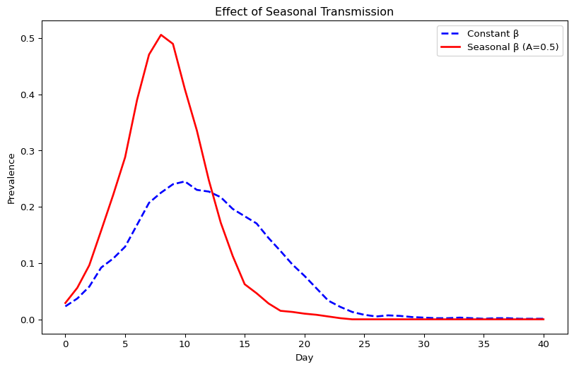
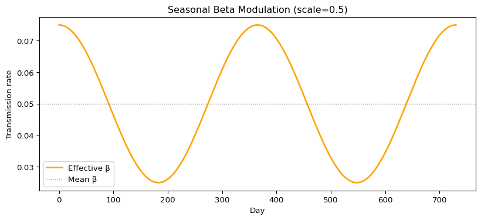
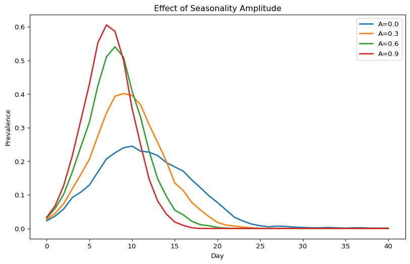
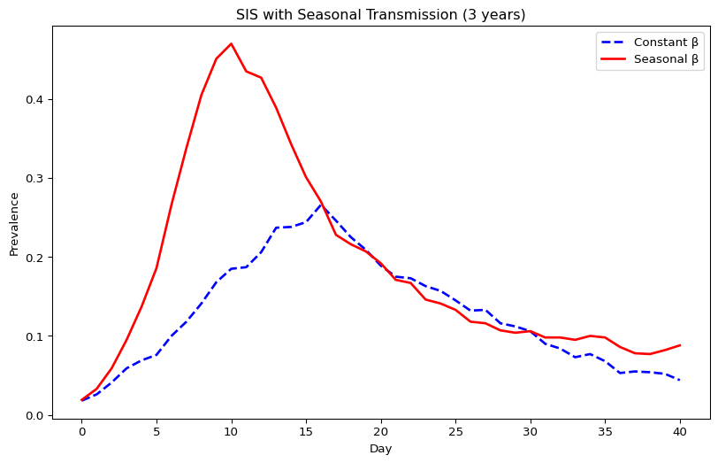
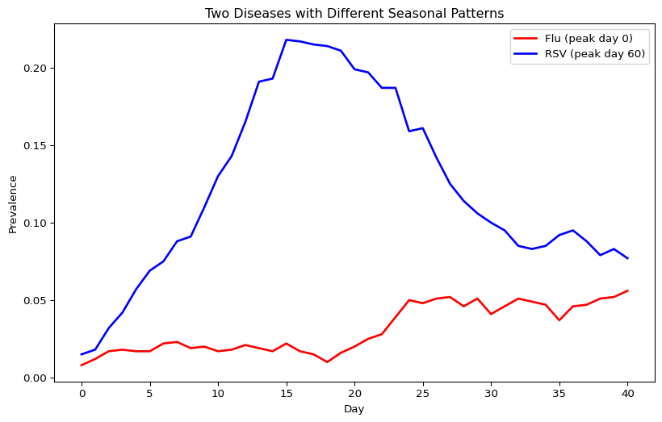

# Connectors (Python)
Simon Frost

- [Overview](#overview)
- [Baseline: constant beta](#baseline-constant-beta)
- [Seasonality connector](#seasonality-connector)
- [Comparing constant vs seasonal
  transmission](#comparing-constant-vs-seasonal-transmission)
- [Visualizing the beta modulation](#visualizing-the-beta-modulation)
- [Varying seasonality amplitude](#varying-seasonality-amplitude)
- [Seasonality with SIS dynamics](#seasonality-with-sis-dynamics)
- [Multi-disease simulation with
  connectors](#multi-disease-simulation-with-connectors)

## Overview

This is the Python companion to the Julia `07_connectors` vignette,
demonstrating the Seasonality connector and multi-disease interactions.

## Baseline: constant beta

``` python
import starsim as ss
import numpy as np
import pylab as pl

n_contacts = 10
beta = 0.5 / n_contacts

sim_base = ss.Sim(
    n_agents=1_000,
    networks=ss.RandomNet(n_contacts=n_contacts),
    diseases=ss.SIR(beta=beta, dur_inf=4, init_prev=0.01),
    dt=1.0, start=0, stop=40, rand_seed=42, verbose=0,
)
sim_base.run()

prev_base = sim_base.results.sir.prevalence.values
print(f"Constant beta peak prevalence: {max(prev_base):.4f}")
```

    Constant beta peak prevalence: 0.2450

## Seasonality connector

``` python
seasonal = ss.seasonality(diseases='sir', scale=0.5, shift=0.0)

sim_seasonal = ss.Sim(
    n_agents=1_000,
    networks=ss.RandomNet(n_contacts=n_contacts),
    diseases=ss.SIR(beta=beta, dur_inf=4, init_prev=0.01),
    connectors=seasonal,
    dt=1.0, start=0, stop=40, rand_seed=42, verbose=0,
)
sim_seasonal.run()

prev_seasonal = sim_seasonal.results.sir.prevalence.values
print(f"Seasonal beta peak prevalence: {max(prev_seasonal):.4f}")
```

    Seasonal beta peak prevalence: 0.5055

## Comparing constant vs seasonal transmission

``` python
pl.figure(figsize=(10, 6))
pl.plot(range(len(prev_base)),     prev_base,     label="Constant β",         lw=2, color="blue", ls="--")
pl.plot(range(len(prev_seasonal)), prev_seasonal, label="Seasonal β (A=0.5)", lw=2, color="red")
pl.xlabel("Day")
pl.ylabel("Prevalence")
pl.title("Effect of Seasonal Transmission")
pl.legend()
pl.show()
```



## Visualizing the beta modulation

``` python
scale = 0.5
shift = 0.0
days = np.arange(0, 365 * 2 + 1)
beta_base = 0.05
beta_eff = beta_base * (1.0 + scale * np.cos(2 * np.pi * (days/365 - shift)))

pl.figure(figsize=(10, 4))
pl.plot(days, beta_eff, lw=2, color="orange", label="Effective β")
pl.axhline(beta_base, lw=1, ls=":", color="gray", label="Mean β")
pl.xlabel("Day")
pl.ylabel("Transmission rate")
pl.title(f"Seasonal Beta Modulation (scale={scale})")
pl.legend()
pl.show()
```



## Varying seasonality amplitude

``` python
amplitudes = [0.0, 0.3, 0.6, 0.9]

pl.figure(figsize=(10, 6))
for amp in amplitudes:
    conn = ss.seasonality(diseases='sir', scale=amp, shift=0.0)
    sim = ss.Sim(
        n_agents=1_000, networks=ss.RandomNet(n_contacts=n_contacts),
        diseases=ss.SIR(beta=beta, dur_inf=4, init_prev=0.01),
        connectors=conn,
        dt=1.0, start=0, stop=40, rand_seed=42, verbose=0,
    )
    sim.run()
    prev = sim.results.sir.prevalence.values
    pl.plot(range(len(prev)), prev, label=f"A={amp}", lw=2)

pl.xlabel("Day")
pl.ylabel("Prevalence")
pl.title("Effect of Seasonality Amplitude")
pl.legend()
pl.show()
```



## Seasonality with SIS dynamics

``` python
sim_sis_base = ss.Sim(
    n_agents=1_000, networks=ss.RandomNet(n_contacts=n_contacts),
    diseases=ss.SIS(beta=beta, dur_inf=4, init_prev=0.01),
    dt=1.0, start=0, stop=40, rand_seed=42, verbose=0,
)
sim_sis_base.run()

sim_sis_seasonal = ss.Sim(
    n_agents=1_000, networks=ss.RandomNet(n_contacts=n_contacts),
    diseases=ss.SIS(beta=beta, dur_inf=4, init_prev=0.01),
    connectors=ss.seasonality(diseases='sis', scale=0.5, shift=0.0),
    dt=1.0, start=0, stop=40, rand_seed=42, verbose=0,
)
sim_sis_seasonal.run()

prev_sis_b = sim_sis_base.results.sis.prevalence.values
prev_sis_s = sim_sis_seasonal.results.sis.prevalence.values

pl.figure(figsize=(10, 6))
pl.plot(range(len(prev_sis_b)), prev_sis_b, label="Constant β", lw=2, color="blue", ls="--")
pl.plot(range(len(prev_sis_s)), prev_sis_s, label="Seasonal β", lw=2, color="red")
pl.xlabel("Day")
pl.ylabel("Prevalence")
pl.title("SIS with Seasonal Transmission (3 years)")
pl.legend()
pl.show()
```



## Multi-disease simulation with connectors

``` python
sim_multi = ss.Sim(
    n_agents=1_000,
    networks=ss.RandomNet(n_contacts=n_contacts),
    diseases=[
        ss.SIS(name='flu', beta=0.03, dur_inf=3, init_prev=0.01),
        ss.SIS(name='rsv', beta=0.04, dur_inf=4, init_prev=0.01),
    ],
    connectors=[
        ss.seasonality(name='seasonal_flu', diseases='flu', scale=0.6, shift=0.0),
        ss.seasonality(name='seasonal_rsv', diseases='rsv', scale=0.4, shift=60/365),
    ],
    dt=1.0, start=0, stop=40, rand_seed=42, verbose=0,
)
sim_multi.run()

prev_flu = sim_multi.results.flu.prevalence.values
prev_rsv = sim_multi.results.rsv.prevalence.values

pl.figure(figsize=(10, 6))
pl.plot(range(len(prev_flu)), prev_flu, label="Flu (peak day 0)",  lw=2, color="red")
pl.plot(range(len(prev_rsv)), prev_rsv, label="RSV (peak day 60)", lw=2, color="blue")
pl.xlabel("Day")
pl.ylabel("Prevalence")
pl.title("Two Diseases with Different Seasonal Patterns")
pl.legend()
pl.show()
```


