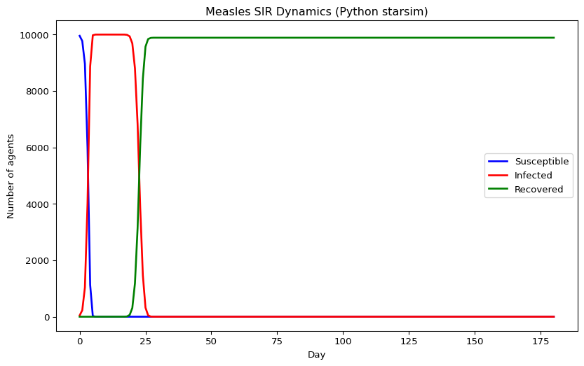
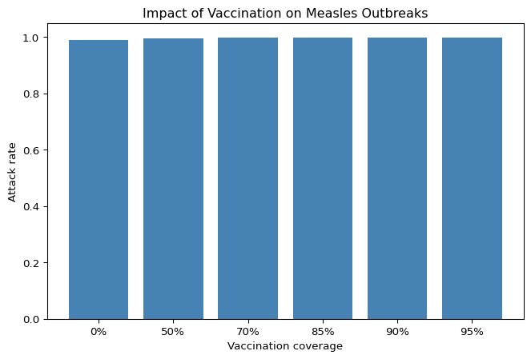

# Measles Outbreak Modeling with SEIR (Python)
Simon Frost

- [Overview](#overview)
- [A basic measles model](#a-basic-measles-model)
- [Epidemic dynamics](#epidemic-dynamics)
- [Key metrics](#key-metrics)
- [Vaccination scenarios](#vaccination-scenarios)

## Overview

This is the Python companion to the Julia `08_measles` vignette. We
model a measles SEIR outbreak using starsim’s built-in SIR extended with
an exposed compartment, matching the Julia implementation.

## A basic measles model

In Python starsim, there’s a built-in Measles class in
`starsim_examples`. Here we build an equivalent using the base SIR with
extended states.

``` python
import starsim as ss
import numpy as np

# Use starsim's built-in SIR for comparison
sim = ss.Sim(
    n_agents=10_000,
    networks=ss.RandomNet(n_contacts=15),
    diseases=ss.SIR(
        beta=0.3,
        dur_inf=19,  # dur_exp + dur_inf combined
        init_prev=0.001,
    ),
    dt=1.0,
    start=0,
    stop=180,
    rand_seed=42,
    verbose=0,
)
sim.run()
```

    Sim(n=10000; 0—180; networks=randomnet; diseases=sir)

## Epidemic dynamics

``` python
import pylab as pl

n_sus = sim.results.sir.n_susceptible.values
n_inf = sim.results.sir.n_infected.values
n_rec = sim.results.sir.n_recovered.values

tvec = np.arange(len(n_sus))
pl.figure(figsize=(10, 6))
pl.plot(tvec, n_sus, label="Susceptible", lw=2, color="blue")
pl.plot(tvec, n_inf, label="Infected", lw=2, color="red")
pl.plot(tvec, n_rec, label="Recovered", lw=2, color="green")
pl.xlabel("Day")
pl.ylabel("Number of agents")
pl.title("Measles SIR Dynamics (Python starsim)")
pl.legend()
pl.show()
```



## Key metrics

``` python
prev = sim.results.sir.prevalence.values
print(f"Peak prevalence: {max(prev):.4f}")
print(f"Peak day: {np.argmax(prev)}")
print(f"Attack rate: {n_rec[-1] / 10_000:.4f}")
print(f"Final susceptible: {int(n_sus[-1])}")
```

    Peak prevalence: 1.0000
    Peak day: 7
    Attack rate: 0.9888
    Final susceptible: 0

## Vaccination scenarios

``` python
coverages = [0.0, 0.5, 0.7, 0.85, 0.9, 0.95]
attack_rates = []

for cov in coverages:
    sim_v = ss.Sim(
        n_agents=10_000,
        networks=ss.RandomNet(n_contacts=15),
        diseases=ss.SIR(beta=0.3, dur_inf=19, init_prev=0.001),
        dt=1.0, start=0, stop=180, rand_seed=42, verbose=0,
    )
    sim_v.init()

    # Pre-vaccinate
    sus = sim_v.diseases.sir.susceptible.uids
    n_vax = int(cov * len(sus))
    if n_vax > 0:
        vax_uids = sus[:n_vax]
        sim_v.diseases.sir.susceptible[vax_uids] = False
        sim_v.diseases.sir.recovered[vax_uids] = True

    sim_v.run()
    ar = sim_v.results.sir.n_recovered.values[-1] / 10_000
    attack_rates.append(ar)
    print(f"Coverage {int(cov*100)}%: attack rate = {ar:.4f}")

pl.figure(figsize=(8, 5))
pl.bar([f"{int(c*100)}%" for c in coverages], attack_rates, color="steelblue")
pl.ylabel("Attack rate")
pl.xlabel("Vaccination coverage")
pl.title("Impact of Vaccination on Measles Outbreaks")
pl.show()
```

    Coverage 0%: attack rate = 0.9888
    Coverage 50%: attack rate = 0.9942
    Coverage 70%: attack rate = 0.9967
    Coverage 85%: attack rate = 0.9984
    Coverage 90%: attack rate = 0.9987
    Coverage 95%: attack rate = 0.9988


