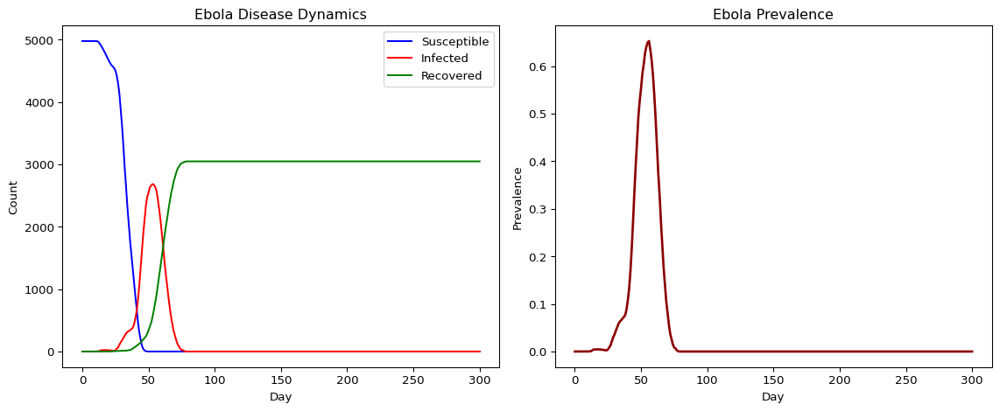

# Ebola: Severity-Structured Disease (Python)
Simon Frost

- [Overview](#overview)
- [Define the Ebola disease](#define-the-ebola-disease)
- [Run the simulation](#run-the-simulation)
- [Plot results](#plot-results)

## Overview

This is the Python companion to the Julia `10_ebola` vignette. We model
Ebola virus disease with severity progression (exposed → symptomatic →
severe → dead/recovered) and burial transmission, following
`starsim_examples/diseases/ebola.py`.

## Define the Ebola disease

``` python
import numpy as np
import starsim as ss

class Ebola(ss.SIR):
    def __init__(self, pars=None, **kwargs):
        super().__init__()
        self.define_pars(
            init_prev       = ss.bernoulli(p=0.005),
            beta            = 0.5,
            sev_factor      = 2.2,
            unburied_factor = 2.1,

            dur_exp2symp    = ss.lognorm_ex(mean=12.7),
            dur_symp2sev    = ss.lognorm_ex(mean=6),
            dur_sev2dead    = ss.lognorm_ex(mean=1.5),
            dur_dead2buried = ss.lognorm_ex(mean=2),
            dur_symp2rec    = ss.lognorm_ex(mean=10),
            dur_sev2rec     = ss.lognorm_ex(mean=10.4),
            p_sev           = ss.bernoulli(p=0.7),
            p_death         = ss.bernoulli(p=0.55),
            p_safe_bury     = ss.bernoulli(p=0.25),
        )
        self.update_pars(pars, **kwargs)

        self.define_states(
            ss.BoolState('exposed'),
            ss.BoolState('severe'),
            ss.BoolState('buried'),
            ss.FloatArr('ti_exposed'),
            ss.FloatArr('ti_severe'),
            ss.FloatArr('ti_buried'),
        )

    def step_state(self):
        ti = self.ti

        infected = (self.exposed & (self.ti_infected <= ti)).uids
        self.exposed[infected] = False
        self.infected[infected] = True

        severe = (self.infected & (self.ti_severe <= ti)).uids
        self.severe[severe] = True

        recovered = (self.infected & (self.ti_recovered <= ti)).uids
        self.infected[recovered] = False
        self.recovered[recovered] = True

        recovered_sev = (self.severe & (self.ti_recovered <= ti)).uids
        self.severe[recovered_sev] = False
        self.recovered[recovered_sev] = True

        deaths = (self.ti_dead <= ti).uids
        if len(deaths):
            self.sim.people.request_death(deaths)

        buried = (self.ti_buried <= ti).uids
        self.buried[buried] = True

    def set_prognoses(self, uids, sources=None):
        if self.infection_log:
            self.infection_log.add_entries(uids, sources, self.now)

        ti = self.ti
        self.susceptible[uids] = False
        self.exposed[uids] = True
        self.ti_exposed[uids] = ti

        p = self.pars
        self.ti_infected[uids] = ti + p.dur_exp2symp.rvs(uids)

        sev_uids = p.p_sev.filter(uids)
        self.ti_severe[sev_uids] = self.ti_infected[sev_uids] + p.dur_symp2sev.rvs(sev_uids)

        dead_uids = p.p_death.filter(sev_uids)
        self.ti_dead[dead_uids] = self.ti_severe[dead_uids] + p.dur_sev2dead.rvs(dead_uids)
        rec_sev = np.setdiff1d(sev_uids, dead_uids)
        self.ti_recovered[rec_sev] = self.ti_severe[rec_sev] + p.dur_sev2rec.rvs(rec_sev)
        rec_symp = np.setdiff1d(uids, sev_uids)
        self.ti_recovered[rec_symp] = self.ti_infected[rec_symp] + p.dur_symp2rec.rvs(rec_symp)

        safe = p.p_safe_bury.filter(dead_uids)
        unsafe = np.setdiff1d(dead_uids, safe)
        self.ti_buried[safe] = self.ti_dead[safe]
        self.ti_buried[unsafe] = self.ti_dead[unsafe] + p.dur_dead2buried.rvs(unsafe)

    def step_die(self, uids):
        for state in ['susceptible', 'exposed', 'infected', 'severe', 'recovered']:
            self.state_dict[state][uids] = False
```

## Run the simulation

``` python
sim = ss.Sim(
    n_agents=5000,
    networks=ss.RandomNet(n_contacts=5),
    diseases=Ebola(beta=0.5),
    dt=1.0,
    start=0,
    stop=300,
    rand_seed=42,
    verbose=0,
)
sim.run()
```

    Sim(n=5000; 0—300; networks=randomnet; diseases=ebola)

## Plot results

``` python
import pylab as pl

res = sim.results.ebola
tvec = np.arange(len(res.n_infected.values))

fig, axes = pl.subplots(1, 2, figsize=(12, 5))

ax = axes[0]
ax.plot(tvec, res.n_susceptible.values, label='Susceptible', color='blue')
ax.plot(tvec, res.n_infected.values, label='Infected', color='red')
ax.plot(tvec, res.n_recovered.values, label='Recovered', color='green')
ax.set_xlabel('Day')
ax.set_ylabel('Count')
ax.set_title('Ebola Disease Dynamics')
ax.legend()

ax = axes[1]
ax.plot(tvec, res.prevalence.values, color='darkred', lw=2)
ax.set_xlabel('Day')
ax.set_ylabel('Prevalence')
ax.set_title('Ebola Prevalence')

pl.tight_layout()
pl.show()

print(f"Peak prevalence: {max(res.prevalence.values):.4f}")
print(f"Peak day: {np.argmax(res.prevalence.values)}")
print(f"Final recovered: {int(res.n_recovered.values[-1])}")
```



    Peak prevalence: 0.6527
    Peak day: 56
    Final recovered: 3048
