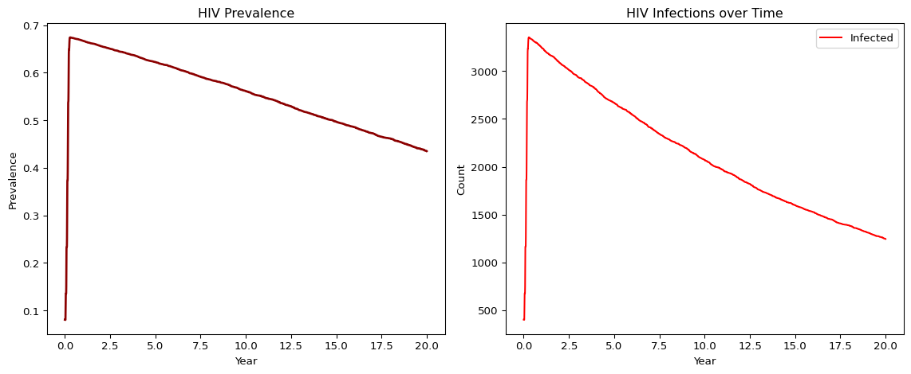

# HIV on Sexual Networks (Python)
Simon Frost

- [Overview](#overview)
- [Define the HIV disease and ART
  intervention](#define-the-hiv-disease-and-art-intervention)
- [Run the simulation](#run-the-simulation)
- [Plot results](#plot-results)

## Overview

This is the Python companion to the Julia `11_hiv` vignette. We model
HIV transmission on a male-female sexual network with ART intervention,
following `starsim_examples/diseases/hiv.py`.

## Define the HIV disease and ART intervention

``` python
import numpy as np
import sciris as sc
import starsim as ss

class HIV(ss.Infection):
    def __init__(self, pars=None, **kwargs):
        super().__init__()
        self.define_pars(
            beta = 0.0,
            cd4_min = 100,
            cd4_max = 500,
            cd4_rate = 5,
            art_efficacy = 0.96,
            init_prev = ss.bernoulli(p=0.05),
            p_death = 0.05 / 365,
        )
        self.update_pars(pars, **kwargs)

        self.define_states(
            ss.BoolState('on_art'),
            ss.FloatArr('ti_art'),
            ss.FloatArr('ti_dead'),
            ss.FloatArr('cd4', default=500),
        )

    def step_state(self):
        people = self.sim.people
        p = self.pars
        alive_inf = people.alive & self.infected
        on_art = alive_inf & self.on_art
        off_art = alive_inf & ~self.on_art

        # CD4 dynamics
        self.cd4[on_art] += (p.cd4_max - self.cd4[on_art]) / p.cd4_rate
        self.cd4[off_art] += (p.cd4_min - self.cd4[off_art]) / p.cd4_rate

        # ART reduces transmission
        self.rel_trans[on_art] = 1 - p.art_efficacy

        # HIV mortality scaled by CD4
        can_die = self.infected.uids
        for uid in can_die:
            scale = (self.cd4[uid] - p.cd4_max)**2 / (p.cd4_min - p.cd4_max)**2
            if np.random.random() < p.p_death * scale:
                self.sim.people.request_death(ss.uids(uid))
                self.ti_dead[uid] = self.ti

    def init_results(self):
        super().init_results()
        self.define_results(
            ss.Result('new_deaths', dtype=int),
            ss.Result('mean_cd4', dtype=float),
        )

    def update_results(self):
        super().update_results()
        ti = self.ti
        self.results['new_deaths'][ti] = np.count_nonzero(self.ti_dead == ti)
        inf_uids = self.infected.uids
        if len(inf_uids) > 0:
            self.results['mean_cd4'][ti] = np.mean(self.cd4[inf_uids])

    def set_prognoses(self, uids, sources=None):
        super().set_prognoses(uids, sources)
        self.susceptible[uids] = False
        self.infected[uids] = True
        self.ti_infected[uids] = self.ti
```

## Run the simulation

``` python
sim = ss.Sim(
    n_agents=5000,
    networks=ss.MFNet(),
    diseases=HIV(beta=dict(mf=0.08)),
    dt=1.0,
    start=0,
    stop=365 * 20,  # 20 years
    rand_seed=42,
    verbose=0,
)
sim.run()
```

    Sim(n=5000; 0—7300; networks=mfnet; diseases=hiv)

## Plot results

``` python
import pylab as pl

res = sim.results.hiv
tvec = np.arange(len(res.prevalence.values)) / 365

fig, axes = pl.subplots(1, 2, figsize=(12, 5))

ax = axes[0]
ax.plot(tvec, res.prevalence.values, color='darkred', lw=2)
ax.set_xlabel('Year')
ax.set_ylabel('Prevalence')
ax.set_title('HIV Prevalence')

ax = axes[1]
ax.plot(tvec, res.n_infected.values, label='Infected', color='red')
ax.set_xlabel('Year')
ax.set_ylabel('Count')
ax.set_title('HIV Infections over Time')
ax.legend()

pl.tight_layout()
pl.show()

print(f"Final prevalence: {res.prevalence.values[-1]:.4f}")
print(f"Peak infected: {int(max(res.n_infected.values))}")
```



    Final prevalence: 0.4352
    Peak infected: 3351
