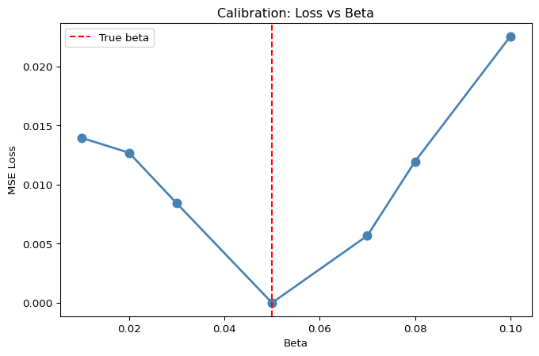
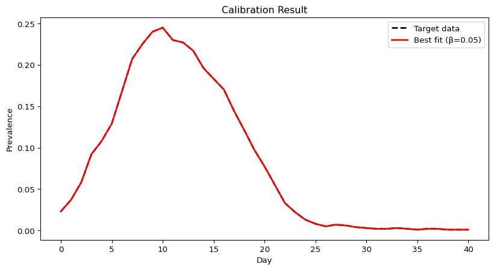

# Calibration: Fitting Models to Data (Python)
Simon Frost

- [Overview](#overview)
- [Generate synthetic target data](#generate-synthetic-target-data)
- [Manual calibration approach](#manual-calibration-approach)
- [Best fit visualization](#best-fit-visualization)

## Overview

This is the Python companion to the Julia `13_calibration` vignette. We
calibrate an SIR model to synthetic prevalence data using starsim’s
built-in calibration tools.

## Generate synthetic target data

``` python
import starsim as ss
import numpy as np
import pylab as pl

# Generate "truth" with known beta
n_contacts = 10
beta = 0.5 / n_contacts  # = 0.05

true_sim = ss.Sim(
    n_agents=1000,
    networks=ss.RandomNet(n_contacts=n_contacts),
    diseases=ss.SIR(beta=beta, dur_inf=4, init_prev=0.01),
    dt=1.0,
    start=0,
    stop=40,
    rand_seed=42,
    verbose=0,
)
true_sim.run()

target_prev = true_sim.results.sir.prevalence.values.copy()
print(f"True beta: 0.05")
print(f"Peak prevalence: {max(target_prev):.4f}")
```

    True beta: 0.05
    Peak prevalence: 0.2450

## Manual calibration approach

We’ll try different beta values and compare the fit.

``` python
betas = [0.01, 0.02, 0.03, 0.05, 0.07, 0.08, 0.10]
losses = []

for beta in betas:
    sim = ss.Sim(
        n_agents=1000,
        networks=ss.RandomNet(n_contacts=n_contacts),
        diseases=ss.SIR(beta=beta, dur_inf=4, init_prev=0.01),
        dt=1.0, start=0, stop=40, rand_seed=42, verbose=0,
    )
    sim.run()

    prev = sim.results.sir.prevalence.values
    n = min(len(prev), len(target_prev))
    mse = np.mean((prev[:n] - target_prev[:n])**2)
    losses.append(mse)
    print(f"beta={beta:.2f}: MSE={mse:.6f}")

pl.figure(figsize=(8, 5))
pl.plot(betas, losses, 'o-', color='steelblue', lw=2, markersize=8)
pl.xlabel('Beta')
pl.ylabel('MSE Loss')
pl.title('Calibration: Loss vs Beta')
pl.axvline(0.05, color='red', ls='--', label='True beta')
pl.legend()
pl.show()
```

    beta=0.01: MSE=0.013972
    beta=0.02: MSE=0.012705
    beta=0.03: MSE=0.008425
    beta=0.05: MSE=0.000000
    beta=0.07: MSE=0.005685
    beta=0.08: MSE=0.011964
    beta=0.10: MSE=0.022552



## Best fit visualization

``` python
best_beta = betas[np.argmin(losses)]
best_sim = ss.Sim(
    n_agents=1000,
    networks=ss.RandomNet(n_contacts=n_contacts),
    diseases=ss.SIR(beta=best_beta, dur_inf=4, init_prev=0.01),
    dt=1.0, start=0, stop=40, rand_seed=42, verbose=0,
)
best_sim.run()

tvec = np.arange(len(target_prev))
pl.figure(figsize=(10, 5))
pl.plot(tvec, target_prev, 'k--', lw=2, label='Target data')
pl.plot(tvec, best_sim.results.sir.prevalence.values, color='red', lw=2,
        label=f'Best fit (β={best_beta})')
pl.xlabel('Day')
pl.ylabel('Prevalence')
pl.title('Calibration Result')
pl.legend()
pl.show()

print(f"Best beta: {best_beta}")
print(f"Best MSE: {min(losses):.6f}")
```



    Best beta: 0.05
    Best MSE: 0.000000
