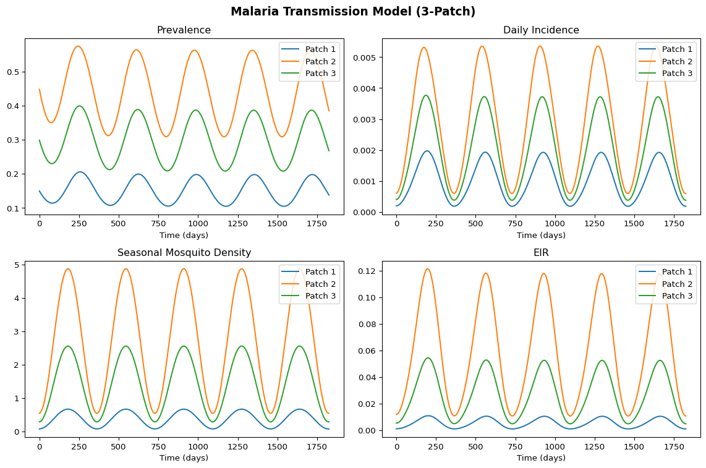

# Malaria Metapopulation Model (Python)
Simon Frost

- [Overview](#overview)
- [Define the malaria module](#define-the-malaria-module)
- [Run the simulation](#run-the-simulation)
- [Plot results](#plot-results)

## Overview

This is the Python companion to the Julia `14_malaria` vignette. We
implement a multi-patch Ross-Macdonald malaria model as a Starsim module
with Euler integration and seasonal mosquito forcing, following
`code/malaria_demo/demo_sim_ss.py`.

## Define the malaria module

``` python
import numpy as np
import starsim as ss
from scipy.stats import norm

def analytical_mosquito_density(ivector, hvector, pij, a, b, c, mu, r, tau):
    xvector = ivector / r
    gvector = xvector * r / (1 - xvector)
    n = len(xvector)
    fvector = np.zeros(n)
    for i in range(n):
        k_i = np.sum(pij[:, i] * xvector * hvector) / np.sum(pij[:, i] * hvector)
        fvector[i] = b * c * k_i / (a * c * k_i / mu + 1)
    fmatrix = np.diag(fvector)
    cvector = np.linalg.solve(pij @ fmatrix, gvector)
    m = cvector * mu / a**2 / np.exp(-mu * tau)
    return m

def make_seasonal_sinusoidal(amplitude=0.8, peak_day=180):
    def seasonal_fn(t):
        day_of_year = t % 365
        return max(0.0, 1 + amplitude * np.sin(2 * np.pi * (day_of_year - peak_day + 365/4) / 365))
    return seasonal_fn

# Default 3-patch data
default_hvector = np.array([5000.0, 10000.0, 8000.0])
default_ivector = np.array([0.001, 0.003, 0.002])
default_pij = np.array([
    [0.85, 0.10, 0.05],
    [0.08, 0.80, 0.12],
    [0.06, 0.09, 0.85],
])

class Malaria_SS(ss.Module):
    def __init__(self, hvector=None, ivector=None, pij=None, seasonal_fn=None, **kwargs):
        super().__init__()
        self.define_pars(
            a=0.3, b=0.1, c=0.214,
            r=1/150, mu=1/10, tau=10,
        )
        self.update_pars(**kwargs)

        self.hvector = hvector if hvector is not None else default_hvector.copy()
        self.ivector = ivector if ivector is not None else default_ivector.copy()
        self.pij = pij if pij is not None else default_pij.copy()
        self.seasonal_fn = seasonal_fn if seasonal_fn is not None else make_seasonal_sinusoidal()
        self.numpatch = len(self.hvector)

        self.c_labels = {}
        for i in range(self.numpatch):
            self.c_labels[f'X_{i}'] = f'Prevalence (Patch {i+1})'
            self.c_labels[f'C_{i}'] = f'Cumulative incidence (Patch {i+1})'

        self.c = {key: 0.0 for key in self.c_labels}
        self.m_base = None

    def init_post(self):
        super().init_post()
        p = self.pars
        self.m_base = analytical_mosquito_density(
            self.ivector, self.hvector, self.pij,
            p.a, p.b, p.c, p.mu, p.r, p.tau,
        )
        self.m_base = np.clip(self.m_base, 1e-10, None)

        x0 = self.ivector / p.r
        for i in range(self.numpatch):
            self.c[f'X_{i}'] = x0[i]
            self.c[f'C_{i}'] = 0.0

    def step(self):
        p = self.pars
        c = self.c
        n = self.numpatch
        t = self.now
        dt = float(self.dt)

        X = np.array([c[f'X_{i}'] for i in range(n)])
        m = self.m_base * self.seasonal_fn(t)

        H = self.hvector
        pij = self.pij
        k = (X * H) @ pij / (H @ pij)

        Z_numer = p.a**2 * p.b * p.c * np.exp(-p.mu * p.tau) * k
        Z_denom = p.a * p.c * k + p.mu
        dC = (m * Z_numer / Z_denom) @ pij.T * (1 - X)
        dX = dC - p.r * X

        for i in range(n):
            c[f'X_{i}'] += dX[i] * dt
            c[f'C_{i}'] += dC[i] * dt

    def init_results(self):
        super().init_results()
        results = []
        for key, label in self.c_labels.items():
            results.append(ss.Result(key, label=label))
        for i in range(self.numpatch):
            results.append(ss.Result(f'daily_inc_{i}', label=f'Daily incidence (Patch {i+1})'))
            results.append(ss.Result(f'm_seasonal_{i}', label=f'Mosquito density (Patch {i+1})'))
            results.append(ss.Result(f'eir_{i}', label=f'EIR (Patch {i+1})'))
        self.define_results(*results)

    def update_results(self):
        super().update_results()
        ti = self.ti
        c = self.c
        p = self.pars
        n = self.numpatch
        t = self.now

        for key in c:
            self.results[key][ti] = c[key]

        X = np.array([c[f'X_{i}'] for i in range(n)])
        m_seasonal = self.m_base * self.seasonal_fn(t)

        H = self.hvector
        pij = self.pij
        k = (X * H) @ pij / (H @ pij)

        Z_numer = p.a**2 * p.b * p.c * np.exp(-p.mu * p.tau) * k
        Z_denom = p.a * p.c * k + p.mu
        dC = (m_seasonal * Z_numer / Z_denom) @ pij.T * (1 - X)

        Z = p.a * p.c * k * np.exp(-p.mu * p.tau) / (p.a * p.c * k + p.mu)
        eir = m_seasonal * p.a * (Z @ pij.T)

        for i in range(n):
            self.results[f'daily_inc_{i}'][ti] = dC[i]
            self.results[f'm_seasonal_{i}'][ti] = m_seasonal[i]
            self.results[f'eir_{i}'][ti] = eir[i]
```

## Run the simulation

``` python
mal = Malaria_SS()
sim = ss.Sim(modules=mal, copy_inputs=False, start=0, stop=365*5, dt=1, n_agents=1)
sim.run()
```

    Initializing sim with 1 agents

      Running 0.0 ( 0/1826) (0.00 s)  ———————————————————— 0%

      Running 10.0 (10/1826) (0.00 s)  ———————————————————— 1%

      Running 20.0 (20/1826) (0.00 s)  ———————————————————— 1%

      Running 30.0 (30/1826) (0.00 s)  ———————————————————— 2%

      Running 40.0 (40/1826) (0.01 s)  ———————————————————— 2%

      Running 50.0 (50/1826) (0.01 s)  ———————————————————— 3%

      Running 60.0 (60/1826) (0.01 s)  ———————————————————— 3%

      Running 70.0 (70/1826) (0.01 s)  ———————————————————— 4%

      Running 80.0 (80/1826) (0.01 s)  ———————————————————— 4%

      Running 90.0 (90/1826) (0.01 s)  ———————————————————— 5%

      Running 100.0 (100/1826) (0.01 s)  •——————————————————— 6%

      Running 110.0 (110/1826) (0.01 s)  •——————————————————— 6%

      Running 120.0 (120/1826) (0.01 s)  •——————————————————— 7%

      Running 130.0 (130/1826) (0.02 s)  •——————————————————— 7%

      Running 140.0 (140/1826) (0.02 s)  •——————————————————— 8%

      Running 150.0 (150/1826) (0.02 s)  •——————————————————— 8%

      Running 160.0 (160/1826) (0.02 s)  •——————————————————— 9%

      Running 170.0 (170/1826) (0.02 s)  •——————————————————— 9%

      Running 180.0 (180/1826) (0.02 s)  •——————————————————— 10%

      Running 190.0 (190/1826) (0.02 s)  ••—————————————————— 10%

      Running 200.0 (200/1826) (0.02 s)  ••—————————————————— 11%

      Running 210.0 (210/1826) (0.02 s)  ••—————————————————— 12%

      Running 220.0 (220/1826) (0.03 s)  ••—————————————————— 12%

      Running 230.0 (230/1826) (0.03 s)  ••—————————————————— 13%

      Running 240.0 (240/1826) (0.03 s)  ••—————————————————— 13%

      Running 250.0 (250/1826) (0.03 s)  ••—————————————————— 14%

      Running 260.0 (260/1826) (0.03 s)  ••—————————————————— 14%

      Running 270.0 (270/1826) (0.03 s)  ••—————————————————— 15%

      Running 280.0 (280/1826) (0.03 s)  •••————————————————— 15%

      Running 290.0 (290/1826) (0.03 s)  •••————————————————— 16%

      Running 300.0 (300/1826) (0.03 s)  •••————————————————— 16%

      Running 310.0 (310/1826) (0.04 s)  •••————————————————— 17%

      Running 320.0 (320/1826) (0.04 s)  •••————————————————— 18%

      Running 330.0 (330/1826) (0.04 s)  •••————————————————— 18%

      Running 340.0 (340/1826) (0.04 s)  •••————————————————— 19%

      Running 350.0 (350/1826) (0.04 s)  •••————————————————— 19%

      Running 360.0 (360/1826) (0.04 s)  •••————————————————— 20%

      Running 370.0 (370/1826) (0.04 s)  ••••———————————————— 20%

      Running 380.0 (380/1826) (0.04 s)  ••••———————————————— 21%

      Running 390.0 (390/1826) (0.05 s)  ••••———————————————— 21%

      Running 400.0 (400/1826) (0.05 s)  ••••———————————————— 22%

      Running 410.0 (410/1826) (0.05 s)  ••••———————————————— 23%

      Running 420.0 (420/1826) (0.05 s)  ••••———————————————— 23%

      Running 430.0 (430/1826) (0.05 s)  ••••———————————————— 24%

      Running 440.0 (440/1826) (0.05 s)  ••••———————————————— 24%

      Running 450.0 (450/1826) (0.05 s)  ••••———————————————— 25%

      Running 460.0 (460/1826) (0.05 s)  •••••——————————————— 25%

      Running 470.0 (470/1826) (0.05 s)  •••••——————————————— 26%

      Running 480.0 (480/1826) (0.06 s)  •••••——————————————— 26%

      Running 490.0 (490/1826) (0.06 s)  •••••——————————————— 27%

      Running 500.0 (500/1826) (0.06 s)  •••••——————————————— 27%

      Running 510.0 (510/1826) (0.06 s)  •••••——————————————— 28%

      Running 520.0 (520/1826) (0.06 s)  •••••——————————————— 29%

      Running 530.0 (530/1826) (0.06 s)  •••••——————————————— 29%

      Running 540.0 (540/1826) (0.06 s)  •••••——————————————— 30%

      Running 550.0 (550/1826) (0.06 s)  ••••••—————————————— 30%

      Running 560.0 (560/1826) (0.06 s)  ••••••—————————————— 31%

      Running 570.0 (570/1826) (0.07 s)  ••••••—————————————— 31%

      Running 580.0 (580/1826) (0.07 s)  ••••••—————————————— 32%

      Running 590.0 (590/1826) (0.07 s)  ••••••—————————————— 32%

      Running 600.0 (600/1826) (0.07 s)  ••••••—————————————— 33%

      Running 610.0 (610/1826) (0.07 s)  ••••••—————————————— 33%

      Running 620.0 (620/1826) (0.07 s)  ••••••—————————————— 34%

      Running 630.0 (630/1826) (0.07 s)  ••••••—————————————— 35%

      Running 640.0 (640/1826) (0.07 s)  •••••••————————————— 35%

      Running 650.0 (650/1826) (0.07 s)  •••••••————————————— 36%

      Running 660.0 (660/1826) (0.08 s)  •••••••————————————— 36%

      Running 670.0 (670/1826) (0.08 s)  •••••••————————————— 37%

      Running 680.0 (680/1826) (0.08 s)  •••••••————————————— 37%

      Running 690.0 (690/1826) (0.08 s)  •••••••————————————— 38%

      Running 700.0 (700/1826) (0.08 s)  •••••••————————————— 38%

      Running 710.0 (710/1826) (0.08 s)  •••••••————————————— 39%

      Running 720.0 (720/1826) (0.08 s)  •••••••————————————— 39%

      Running 730.0 (730/1826) (0.08 s)  ••••••••———————————— 40%

      Running 740.0 (740/1826) (0.08 s)  ••••••••———————————— 41%

      Running 750.0 (750/1826) (0.09 s)  ••••••••———————————— 41%

      Running 760.0 (760/1826) (0.09 s)  ••••••••———————————— 42%

      Running 770.0 (770/1826) (0.09 s)  ••••••••———————————— 42%

      Running 780.0 (780/1826) (0.09 s)  ••••••••———————————— 43%

      Running 790.0 (790/1826) (0.09 s)  ••••••••———————————— 43%

      Running 800.0 (800/1826) (0.09 s)  ••••••••———————————— 44%

      Running 810.0 (810/1826) (0.09 s)  ••••••••———————————— 44%

      Running 820.0 (820/1826) (0.09 s)  ••••••••———————————— 45%

      Running 830.0 (830/1826) (0.09 s)  •••••••••——————————— 46%

      Running 840.0 (840/1826) (0.10 s)  •••••••••——————————— 46%

      Running 850.0 (850/1826) (0.10 s)  •••••••••——————————— 47%

      Running 860.0 (860/1826) (0.10 s)  •••••••••——————————— 47%

      Running 870.0 (870/1826) (0.10 s)  •••••••••——————————— 48%

      Running 880.0 (880/1826) (0.10 s)  •••••••••——————————— 48%

      Running 890.0 (890/1826) (0.10 s)  •••••••••——————————— 49%

      Running 900.0 (900/1826) (0.10 s)  •••••••••——————————— 49%

      Running 910.0 (910/1826) (0.10 s)  •••••••••——————————— 50%

      Running 920.0 (920/1826) (0.11 s)  ••••••••••—————————— 50%

      Running 930.0 (930/1826) (0.11 s)  ••••••••••—————————— 51%

      Running 940.0 (940/1826) (0.11 s)  ••••••••••—————————— 52%

      Running 950.0 (950/1826) (0.11 s)  ••••••••••—————————— 52%

      Running 960.0 (960/1826) (0.11 s)  ••••••••••—————————— 53%

      Running 970.0 (970/1826) (0.11 s)  ••••••••••—————————— 53%

      Running 980.0 (980/1826) (0.11 s)  ••••••••••—————————— 54%

      Running 990.0 (990/1826) (0.11 s)  ••••••••••—————————— 54%

      Running 1000.0 (1000/1826) (0.11 s)  ••••••••••—————————— 55%

      Running 1010.0 (1010/1826) (0.12 s)  •••••••••••————————— 55%

      Running 1020.0 (1020/1826) (0.12 s)  •••••••••••————————— 56%

      Running 1030.0 (1030/1826) (0.12 s)  •••••••••••————————— 56%

      Running 1040.0 (1040/1826) (0.12 s)  •••••••••••————————— 57%

      Running 1050.0 (1050/1826) (0.12 s)  •••••••••••————————— 58%

      Running 1060.0 (1060/1826) (0.12 s)  •••••••••••————————— 58%

      Running 1070.0 (1070/1826) (0.12 s)  •••••••••••————————— 59%

      Running 1080.0 (1080/1826) (0.12 s)  •••••••••••————————— 59%

      Running 1090.0 (1090/1826) (0.12 s)  •••••••••••————————— 60%

      Running 1100.0 (1100/1826) (0.13 s)  ••••••••••••———————— 60%

      Running 1110.0 (1110/1826) (0.13 s)  ••••••••••••———————— 61%

      Running 1120.0 (1120/1826) (0.13 s)  ••••••••••••———————— 61%

      Running 1130.0 (1130/1826) (0.13 s)  ••••••••••••———————— 62%

      Running 1140.0 (1140/1826) (0.13 s)  ••••••••••••———————— 62%

      Running 1150.0 (1150/1826) (0.13 s)  ••••••••••••———————— 63%

      Running 1160.0 (1160/1826) (0.13 s)  ••••••••••••———————— 64%

      Running 1170.0 (1170/1826) (0.13 s)  ••••••••••••———————— 64%

      Running 1180.0 (1180/1826) (0.14 s)  ••••••••••••———————— 65%

      Running 1190.0 (1190/1826) (0.14 s)  •••••••••••••——————— 65%

      Running 1200.0 (1200/1826) (0.14 s)  •••••••••••••——————— 66%

      Running 1210.0 (1210/1826) (0.14 s)  •••••••••••••——————— 66%

      Running 1220.0 (1220/1826) (0.14 s)  •••••••••••••——————— 67%

      Running 1230.0 (1230/1826) (0.14 s)  •••••••••••••——————— 67%

      Running 1240.0 (1240/1826) (0.14 s)  •••••••••••••——————— 68%

      Running 1250.0 (1250/1826) (0.14 s)  •••••••••••••——————— 69%

      Running 1260.0 (1260/1826) (0.14 s)  •••••••••••••——————— 69%

      Running 1270.0 (1270/1826) (0.15 s)  •••••••••••••——————— 70%

      Running 1280.0 (1280/1826) (0.15 s)  ••••••••••••••—————— 70%

      Running 1290.0 (1290/1826) (0.15 s)  ••••••••••••••—————— 71%

      Running 1300.0 (1300/1826) (0.15 s)  ••••••••••••••—————— 71%

      Running 1310.0 (1310/1826) (0.15 s)  ••••••••••••••—————— 72%

      Running 1320.0 (1320/1826) (0.15 s)  ••••••••••••••—————— 72%

      Running 1330.0 (1330/1826) (0.15 s)  ••••••••••••••—————— 73%

      Running 1340.0 (1340/1826) (0.15 s)  ••••••••••••••—————— 73%

      Running 1350.0 (1350/1826) (0.15 s)  ••••••••••••••—————— 74%

      Running 1360.0 (1360/1826) (0.16 s)  ••••••••••••••—————— 75%

      Running 1370.0 (1370/1826) (0.16 s)  •••••••••••••••————— 75%

      Running 1380.0 (1380/1826) (0.16 s)  •••••••••••••••————— 76%

      Running 1390.0 (1390/1826) (0.16 s)  •••••••••••••••————— 76%

      Running 1400.0 (1400/1826) (0.16 s)  •••••••••••••••————— 77%

      Running 1410.0 (1410/1826) (0.16 s)  •••••••••••••••————— 77%

      Running 1420.0 (1420/1826) (0.16 s)  •••••••••••••••————— 78%

      Running 1430.0 (1430/1826) (0.16 s)  •••••••••••••••————— 78%

      Running 1440.0 (1440/1826) (0.17 s)  •••••••••••••••————— 79%

      Running 1450.0 (1450/1826) (0.17 s)  •••••••••••••••————— 79%

      Running 1460.0 (1460/1826) (0.17 s)  ••••••••••••••••———— 80%

      Running 1470.0 (1470/1826) (0.17 s)  ••••••••••••••••———— 81%

      Running 1480.0 (1480/1826) (0.17 s)  ••••••••••••••••———— 81%

      Running 1490.0 (1490/1826) (0.17 s)  ••••••••••••••••———— 82%

      Running 1500.0 (1500/1826) (0.17 s)  ••••••••••••••••———— 82%

      Running 1510.0 (1510/1826) (0.17 s)  ••••••••••••••••———— 83%

      Running 1520.0 (1520/1826) (0.17 s)  ••••••••••••••••———— 83%

      Running 1530.0 (1530/1826) (0.18 s)  ••••••••••••••••———— 84%

      Running 1540.0 (1540/1826) (0.18 s)  ••••••••••••••••———— 84%

      Running 1550.0 (1550/1826) (0.18 s)  ••••••••••••••••———— 85%

      Running 1560.0 (1560/1826) (0.18 s)  •••••••••••••••••——— 85%

      Running 1570.0 (1570/1826) (0.18 s)  •••••••••••••••••——— 86%

      Running 1580.0 (1580/1826) (0.18 s)  •••••••••••••••••——— 87%

      Running 1590.0 (1590/1826) (0.18 s)  •••••••••••••••••——— 87%

      Running 1600.0 (1600/1826) (0.18 s)  •••••••••••••••••——— 88%

      Running 1610.0 (1610/1826) (0.18 s)  •••••••••••••••••——— 88%

      Running 1620.0 (1620/1826) (0.19 s)  •••••••••••••••••——— 89%

      Running 1630.0 (1630/1826) (0.19 s)  •••••••••••••••••——— 89%

      Running 1640.0 (1640/1826) (0.19 s)  •••••••••••••••••——— 90%

      Running 1650.0 (1650/1826) (0.19 s)  ••••••••••••••••••—— 90%

      Running 1660.0 (1660/1826) (0.19 s)  ••••••••••••••••••—— 91%

      Running 1670.0 (1670/1826) (0.19 s)  ••••••••••••••••••—— 92%

      Running 1680.0 (1680/1826) (0.19 s)  ••••••••••••••••••—— 92%

      Running 1690.0 (1690/1826) (0.19 s)  ••••••••••••••••••—— 93%

      Running 1700.0 (1700/1826) (0.20 s)  ••••••••••••••••••—— 93%

      Running 1710.0 (1710/1826) (0.20 s)  ••••••••••••••••••—— 94%

      Running 1720.0 (1720/1826) (0.20 s)  ••••••••••••••••••—— 94%

      Running 1730.0 (1730/1826) (0.20 s)  ••••••••••••••••••—— 95%

      Running 1740.0 (1740/1826) (0.20 s)  •••••••••••••••••••— 95%

      Running 1750.0 (1750/1826) (0.20 s)  •••••••••••••••••••— 96%

      Running 1760.0 (1760/1826) (0.20 s)  •••••••••••••••••••— 96%

      Running 1770.0 (1770/1826) (0.20 s)  •••••••••••••••••••— 97%

      Running 1780.0 (1780/1826) (0.20 s)  •••••••••••••••••••— 98%

      Running 1790.0 (1790/1826) (0.21 s)  •••••••••••••••••••— 98%

      Running 1800.0 (1800/1826) (0.21 s)  •••••••••••••••••••— 99%

      Running 1810.0 (1810/1826) (0.21 s)  •••••••••••••••••••— 99%

      Running 1820.0 (1820/1826) (0.21 s)  •••••••••••••••••••— 100%

    Sim(n=1; 0—1825)

## Plot results

``` python
import pylab as pl

res = sim.results.malaria_ss
npts = len(res.X_0.values)
tvec = np.arange(npts)
patches = ['Patch 1', 'Patch 2', 'Patch 3']

fig, axes = pl.subplots(2, 2, figsize=(12, 8))

ax = axes[0, 0]
for i, name in enumerate(patches):
    ax.plot(tvec, res[f'X_{i}'].values, label=name)
ax.set_title('Prevalence')
ax.set_xlabel('Time (days)')
ax.legend()

ax = axes[0, 1]
for i, name in enumerate(patches):
    ax.plot(tvec, res[f'daily_inc_{i}'].values, label=name)
ax.set_title('Daily Incidence')
ax.set_xlabel('Time (days)')
ax.legend()

ax = axes[1, 0]
for i, name in enumerate(patches):
    ax.plot(tvec, res[f'm_seasonal_{i}'].values, label=name)
ax.set_title('Seasonal Mosquito Density')
ax.set_xlabel('Time (days)')
ax.legend()

ax = axes[1, 1]
for i, name in enumerate(patches):
    ax.plot(tvec, res[f'eir_{i}'].values, label=name)
ax.set_title('EIR')
ax.set_xlabel('Time (days)')
ax.legend()

pl.suptitle('Malaria Transmission Model (3-Patch)', fontsize=14, fontweight='bold')
pl.tight_layout()
pl.show()
```


